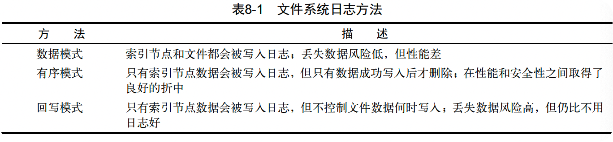

> 使用Linux系统的时候，需要作出的决策之一就是决定为存储设备选用什么文件系统。大多数Linux发行版在安装的时候会默认的文件系统，大多数入门级用户想都不想就使用了默认的那个。
>
> 使用默认的文件系统未必就不好，但了解一下可用的选择有时可能也会有所帮助。

[TOC]

# 探索Linux文件系统

Linux支持多种类型的文件系统管理文件和目录。每种文件系统都存在存储设备上实现了虚拟目录结构，仅仅是特性略有不同。

## 基本的Linux文件系统

Linux最初采用的是一种最简单的文件系统，它模仿了UNIX文件系统的功能。

### 1. ext系统

Linux文件系统重引入的最早的文件系统加做*扩展文件系统（extended filesystem，ext）*。它为Linux提供了一个基本的类UNIX文件系统：**使用虚拟目录来操作硬件设备，在物理设备上按定长的块来存储数据**

ext文件系统采用名为*索引节点*的系统来存放虚拟目录中所存储文件的信息。索引节点系统在每个物理设备中创建一个单独的表（成为索引节点表）来存储这些文件的信息。存储在虚拟目录中的每一个文件都在索引节点表中有一个条目。ext文件系统名称中的extended部分来自其跟踪的每个文件的额外数据，包括：

* 文件名
* 文件大小
* 文件的属主
* 文件的属组
* 文件的访问权限
* 指向存有文件数据的每个硬盘块的指针

Linux通过唯一的数值（称作索引节点号）来引用索引节点表中的每个索引节点，这个值是创建文件时由文件系统分配的。文件系统通过索引节点号而不是文件全名或路径来标识文件。

### 2. ext2文件系统

最早的ext文件系统有不少限制，比如文件大小不得超过2G。在Linux出现后不久，ext文件系统升级到了第二代ext2。

ext2文件系统是ext文件系统基本功能的一个扩展，但保持了同样的结构。ext2文件系统扩展了索引节点表的格式来保存系统上每个文件的更多信息。

ext2的索引节点表位文件添加了创建时间值、修改时间值和最后访问时间值来帮助系统管理员追踪文件的访问情况。ext2文件系统还将允许的最大文件大小增加到了2TB（在后期被增加到了32TB），以容纳数据库服务器中常见的大文件。

>  除了扩展索引节点表外，ext2文件系统还改变了文件在数据块中存储的方式。ext文件系统常见的问题是在文件写入到物理设备时，存储数据用的块很容易分散在整个设备中（称作碎片化，fragmentation）。数据块的碎片化会降低文件系统的性能，因为需要更长的时间在存储设备中查找特定文件的所有块。

保存文件时，ext2文件系统通过按照组分配磁盘块来减轻碎片化。通过将数据块分组，文件系统在读取文件时不需要为了数据块查找整个物理设备。

> 多年来，ext文件系统一直都是Linux发行版采用的默认文件系统。但它也有一些限制。索引节点表虽然支持文件系统保存有关文件的更多信息，但会对系统造成致命的问题。
>
> 文件系统每次存储或更新文件，它都要用信息系来更新索引节点表。问题在于这种操作并非总是一气呵成的。

如果计算机系统在存储文件和更新索引节点表之间发生了什么，这二者的内容就不同步了。ext2文件系统由于容易在系统崩溃或断电时损坏而臭名昭著。即使文件数据正常保存到了物理设备上，如果索引节点表记录没有完成更新的话，ext2文件系统甚至都不知道那个文件存在。

## 日志文件系统

日志文件系统为Linux系统增加了一层安全性。它不再使用之前先将数据直接写入存储设备再更新索引节点表的做法，而是先将文件的更改写入到临时文件（称作日志，journal）中。在数据成功写到存储设备和索引节点表之后，再删除对应的日志条目。

如果系统在数据被写入存储设备之前崩溃或者断电了，日志文件系统下次会读取日志文件并处理上次留下的未写入的数据。



数据模式日志方法是目前为止最安全的数据保护方法，但同时也是最慢的。所有写到存储设备上的数据都必须写两次：第一次写入日志，第二次写入真正的存储设备。这样会导致性能很差，尤其是对做大量数据写入的数据而言。

### 1. ext3文件系统

> 2001年，ext3文件系统被引入Linux内核中，直到最近都是几乎所有Linux发行版默认的文件系统。

ext3文件系统采用和ext2文件系统相同的索引节点表机构，但给每个存储设备增加了一个日志文件，以将准备写入存储设备的数据先写入日志。

默认情况下，ext3文件系统用有序模式的日志功能——只将索引节点信息写入日志文件，直到数据块都被成功写入存储设备才删除。我们可以在创建文件系统时用简单的一个命令行选项将ext3文件系统的日志方法改成数据模式或回写模式。

虽然ext3文件系统为Linux文件系统增加了基本的日志功能，但它仍然缺少了一些功能。例如，ext3文件系统无法恢复误删的文件，它没有任何内建的数据压缩功能（虽然有个需要单独安装的补丁支持这个功能），ext3文件系统也不支持加密文件。

### 2. ext4文件系统

ext4文件系统在2008年受到Linux内核官方支持，现在已经是大多数流行的Linux发行版采用的默认文件系统，比如Ubuntu。

除了支持数据压缩和加密，ext4文件系统还支持一个称作区段（extent）的特性。区段在存储设备上按块分配空间，但在索引节点表中只保存起始块的位置。由于无须列出所有用来存储文件中的数据的数据块，它可以在索引节点表中节省一点空间。

ext4还引入了块分配技术。如果想在存储设备上给一个我们知道将来会变大的文件预留空间，ext4文件系统可以为文件分配所有需要用到的块，而不仅仅是那些现在已经用到的块。ext4文件系统用0填满预留的数据块，不会将它们分配各其他文件。

### 3. Reiser文件系统

> 2001年，Hans Reiser位Linux创建了第一个成为ReiserFS的日志文件系统。ReiserFS文件系统只支持回写日志模式——只把索引节点表数据写到日志文件。ReiserFS文件系统也因此成为Linux上最快的日志文件系统之一。

有两个有意思的特性被引入了ReiserFS文件系统：一个是我们可以在线调整已有文件系统的大小；另一个是被成为尾部压缩（tailpacking）的技术，该技术能将一个文件的数据填进另一个文件的数据块中的空白空间。如果我们必须为已有的文件系统扩容来容纳更多的数据，在线调整文件系统大小功能非常好用。

### 4. JFS文件系统

### 5. XFS文件系统

## 写时复制文件系统

采用了日志式技术，我们就必须在安全性和性能之间做出选择。尽管数据模式日志提供了最高的安全性，但是会对性能带来影响，因为索引节点和数据都需要被日志化。如果是回写模式日志，性能倒是可以接受，但是安全性就会受到损害。

就文件系统而言，日志式的另一种选择是一种叫做*写时复刻(copy-on-write, COW)*的技术。COW利用快照兼顾了安全性和性能。如果要修改数据，会使用克隆或者可写快照。修改过的数据并不会直接覆盖当前数据，而是被放入文件系统中的另一个位置上。即便是数据修改已经完成，之前的旧数据也不会被重写。

### 1. ZFS文件系统

### 2. Btrf文件系统

# 操作文件系统

Linux提供了一些不同的工具，我们可以利用它们轻松地在命令行中进行文件系统操作。可使用键盘随心所欲创建新的文件系统或者修改已有的文件系统。

## 创建分区

一开始，我们必须在存储设备上创建分区来容纳文件系统。分区可以是整个硬盘，也可以是部分硬盘，以容纳虚拟目录的一部分。

`fdisk`工具用来帮助管理安装在系统上的任何存储设备上的分区。它是个交互式程序，来允许你输入命令来逐步完成硬盘分区操作。

要启动`fdisk`命令，我们必须指定要分区的存储设备的设备名，另外还得有超级用户权限。如果在没有对应权限的情况下使用该命令，我们会得到类似下面这种错误提示：

```shell
$ fdisk /dev/sdb
Unable to open /dev/sdb
```

> 有时候，创建新磁盘分区最麻烦的事情就是找出安装在Linux系统中的物理磁盘。Linux采用了一种标准格式来为硬盘分配设备名称，但是你得书序这种格式。
>
> 对于老师的IDE驱动器，Linux使用的是`/dev/hdx`。其中`x`表示一个字母，具体是什么要根据驱动器的检测顺序（第一个驱动器是`a`，第二个驱动器是`b`，一次类推）。
>
> 对于较新的SATA驱动器和SCSI驱动器，Linux使用`/dev/sdx`。其中的具体是什么也要根据驱动器的检测顺序（第一个驱动器是`a`，第二个驱动器是`b`，以此类推）。
>
> 在格式化分区之前，最好再检查一下是否制定了驱动器。

。。。
