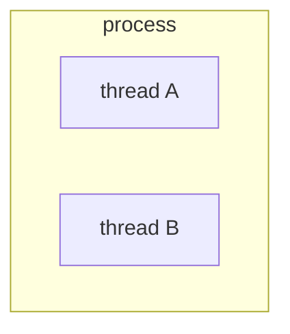

> [linux进程间通信](https://www.bilibili.com/video/BV1tJ41117ty?vd_source=8b03f6e8f77627cf848cfa96e05c2f23)

# 进程通信概述

## 什么是进程间通信？什么是线程间通信？

进程通信：在用户控件实现进程通信是**不可能的**，通过Linux内核通信

线程间通信：可以在用户空间就可以实现，可以通过全局变量通信

## 有集中通信方式？

+ 管道通信：无名管道、有名管道

    有名和无名的含义是，文件系统中是否存在这个管道文件

+ 信号通信：信号的发送、信号的接收和信号的处理

+ IPC（Inter-Process Communication）：共享内存、消息队里和信号灯

+ Socket通信：存在于一个网络中两个进程之间的通信

## 进程通信的学习思路

> 每一种通信方式都是基于文件IO的思想

+ `open`：创建或打开进程通信对象。函数形式不一样，有的是多个函数完成
+ `write`：向进程通信对象中写入内容。函数形式可能不一样。
+ `read`：从进程通信对象中读取内容。函数形式可能不一样。
+ `close`：关闭或删除进程通信对象。函数形式可能不一样

