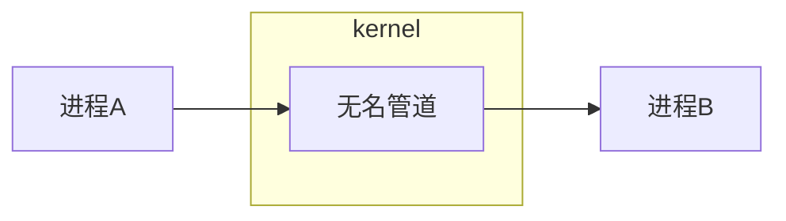

[TOC]

# 无名管道

> 文件系统中不存在这个文件节点

## 通信原理



管道文件是一个特殊的文件，是由队列来实现的。

在文件IO中创建一个文件或打开一个文件是由`open`函数来实现的，**它不能创建管道文件**。只能使用`pipe`函数来创建管道

```c
/*
 * 功能	创建管道，为系统调用 —— unistd.h
 * 参数	就是得到的文件描述符。可见有两个文件描述符：`fd[0]`和`fd[1]`，
 *		管道有一个读端`fd[0]`用来读和一个写端`fd[1]`用来写，这个规定不能变
 * 返回值	成功为0，失败为-1
 */
int pipe(int fd[2]);
```

## 示例一

### 创建管道

[***`create.c`***](./code/pipe/unnamed_pipe/create.c)

### 在单进程中使用管道文件

[***IO_single.c***](./code/pipe/unnamed_pipe/IO_single.c)

## ***注意***

+ 管道是创建在内存中的，进程结束、空间释放，管道就不存在了
+ 管道中的东西，读完就删除了——队列的性质
+ 如果管道中没有东西可读，就会阻塞

## 示例二

### 验证读阻塞

> 在从管道中读取数据之后，再次读取，从而触发读阻塞

[***`block_read.c`***](./code/pipe/unnamed_pipe/block_read.c)

### 验证写阻塞

> 在管道中写满之后，继续写入，从而触发写阻塞
>
> 这个方式可以用来测试管道的大小

[***`block_write.c`***](./code/pipe/unnamed_pipe/block_write.c)

### 实现进程通信

> 实现两个进程间的通信

[***`communicate.c`***](./code/pipe/unnamed_pipe/communicate.c)

## 缺点

不能实现不是父子进程（非亲缘关系）之间的通信

# 有名管道

> 文件系统中存在文件节点
