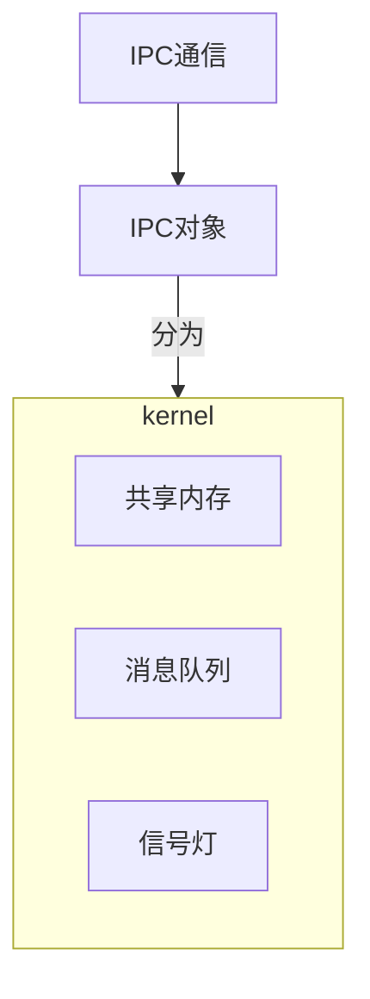
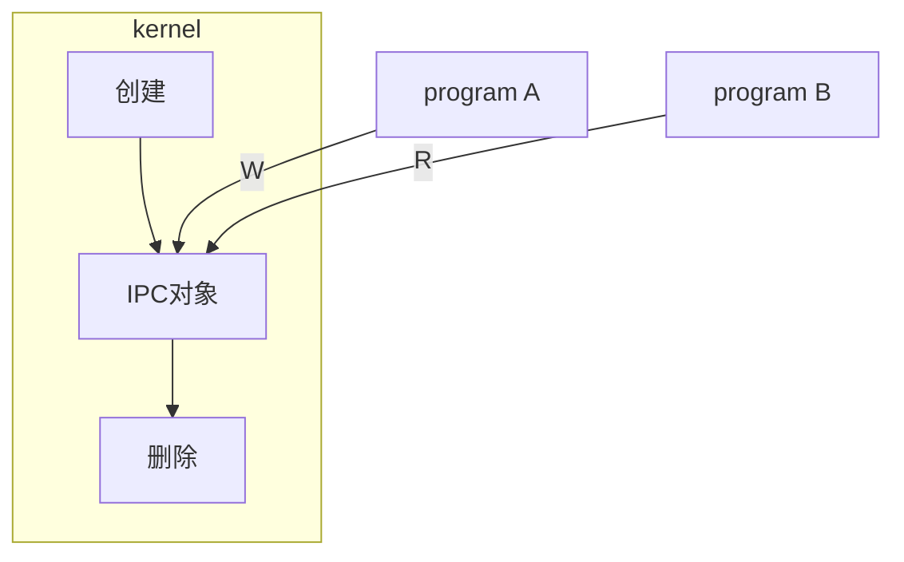
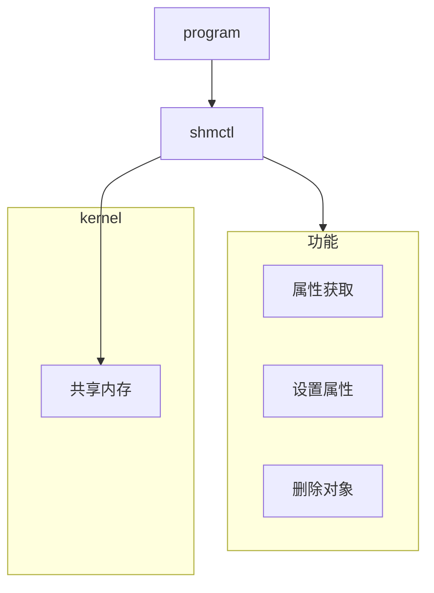
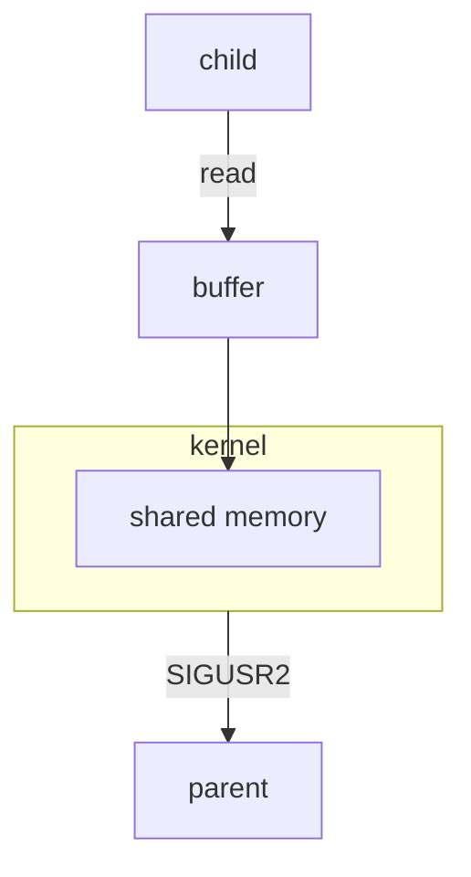
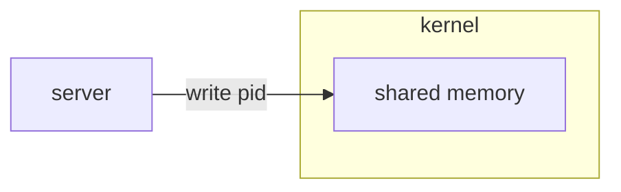
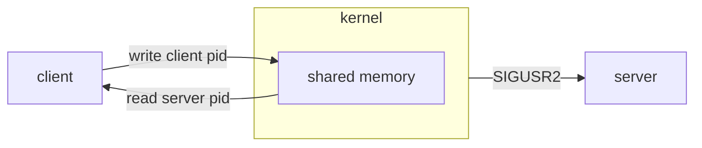
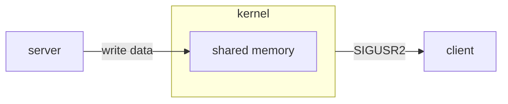
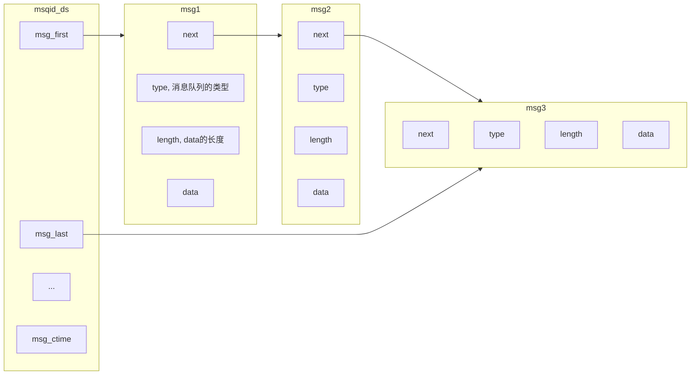

[TOC]

# IPC通信概述

## IPC运行逻辑




IPC的思路和文件IO的思路相同，创建，I/O，删除，只不过函数的名称不同

## 查看内核IPC对象——`ipcs`

+ 查看共享内存：`ipcs -m`
+ 查看消息队列：`ipcs -q`
+ 查看信号灯：`ipcs -s`

## 删除内核IPC对象——`ipcrm`

删除的选项同[查看](#查看内核IPC对象——`ipcs`)，只是需要额外添加要删除的IPC对象的id号

# 共享内存（Shared Memory）

## 共享内存的创建和打开——`shmget`

### 函数定义

```c
#include <sys/shm.h>

/*
 * key		IPC_PRIVATE或ftok的返回值
 * size		共享内存区大小
 * shmflg	同open函数的权限位，也可以使用八进制表示法
 */
// 成功：返回共享内存段标识符，类似文件描述符
// 失败：返回-1
int shmget(key_t key, size_t size, int shmflg);
```

[***`shmget.c`中的`ifndef`部分***](./code/IPC/shm/shmget.c)

### `key`参数

#### `ftok`

如果我们使用`IPC_PRIVATE`，那么创建的共享内存的KEY值永远都是`0x00000000`（可以通过`ipcs`查看）。这样的好处是，由于共享内存的值一直都是0，所以只要任何进程通过`shmget`函数打开这片内存进行操作。

如果我们使用`ftok`函数，他就会返回一个`key`值。

```c
#include <sys/ipc.h>

/*
 * path	文件路径和文件名
 * key	一个字符
 */
// 成功：返回一个key值
// 失败：返回-1
key_t ftok(const char *path, int id);
```
[***`shmget.c`中的`else`部分***](./code/IPC/shm/shmget.c)

> ###### 需要注意的是，如果使用`ftok`返回的key值作为`shmget`的参数，一定要在读写权限出加上`IPC_CREATE`

#### 与管道的类比

在管道的部分，无名管道只能用于有亲缘关系进程之间的通信，而有名管道可以作为无亲缘关系进程之间的通信方式

在此处，IPC_PRIVATE就像有名管道，使用`ftok`函数创建的IPC对象就像无名管道。

## 共享内存的读写——`shmat`

如果我们使用`read`和`write`，那么不仅我们首先需要在程序中准备缓冲区，将将要传递的消息格式化到缓冲区，然后再将缓冲区的内容进行写入，或者将共享内存中的内容读出；同时，我们还需要在用户态和内核态之间反复横跳。

`shmat`的功能是，在用户区开辟一块内存，作为内核中共享内存的映射。我们向这片内存的IO操作，就会等同于我们对共享内存进行IO。

### 函数定义

```c
#include <sys/shm.h>

/*
 * shmid	共享内存ID
 * shmaddr	映射到的地址，NULL为系统自动完成映射
 * shmflg	SHM_RDONLY表示内存只读，默认是0，代表共享内存可读写
 */
// 成功：返回映射后的地址
// 失败：NULL
void *shmat(int shmid, const void *shmaddr, int shmflg);
```

### 举个栗子

[***`shmget_IO.c`***](./code/IPC/shm/shmget_IO.c)

### 共享内存的特点

+ 共享内存创建之后，一直存在于内核中，直到被删除或系统关闭
+ 共享内存和管道不一样，读取完后，内容仍在共享内存中

## 共享内存的删除——`shmdt` & `shmctl`

### 用户区映射内存的释放——`shmdt`

> [***`shmdt.c`***](./code/IPC/shm/shmdt.c)
```c
#include <sys/shm.h>

/*
 * shmaddr	共享内存映射的地址
 */
// 成功返回0，失败返回-1
int shmdt(const void *shmaddr);
```

### 内核共享内存的释放——`shmctl`

> [***`shmctl.c`***](./code/IPC/shm/shmctl.c)
```c
#include <sys/shm.h>

/*
 * shmid	要操作的共享内存标识符
 * cmd		IPC_STAT	获取对象属性
 *			IPC_SET		设置对象属性
 *			IPC_RMID	删除对象
 * buf		指定IPC_STAT/IPC_SET时用以保存/设置属性
 */
// 成功返回0，失败返回-1
int shmctl(int shmid, int cmd, struct shmid_ds *buf);
```

对于删除操作来说，第三个参数是多余的，设置为NULL即可。



## 你已经掌握加法啦，来试试微积分吧！

### 实现父子进程间通信

> [***communicate_with_child.c***](./code/IPC/shm/communicate_with_child.c)

<table>
<tr>
<td>


</td>
<td>



</td>
</table>

这个程序只实现了父进程与子进程的单向通信。如果需要让子进程能够与父进程通信，那么可以再开辟一个共享内存。

### 独立进程间通信

> [***`serv.c`***](./code/IPC/shm/serv.c)与[***`clnt.c`***](./code/IPC/shm/clnt.c)

服务端将自身PID写到共享内存中



客户端启动，直接从共享内存读取pid，然后写入自身PID，发送信号让服务端读取client的PID



服务端读取客户端PID，然后写入数据，发信号让客户端读取数据



# 消息队列



## 消息队列和管道的区别

管道是管道队列，消息队列是链式队列

管道中的数据没有类型，只是一个个字节；消息队列中的消息可以有类型

## 消息队列的操作

### 消息队列的创建和打开——`msgget`

> [***`msgget.c`***](./code/IPC/msq/msgget.c)

```c
#include <sys/msg.h>

/*
 * key	和消息队列关联的key值
 * flag	消息队列的访问权限
 */
// 成功：返回消息队列ID
// 失败：返回-1
int msgget(key_t key, int flag);
```

### 消息队列的删除——`msgctl`

> [***`msgctl.c`***](./code/IPC/msq/msgctl.c)

```c
#include <sys/msg.h>

/*
 * msqid	消息队列的队列ID
 * cmd		IPC_STAT	读取消息队列的属性，并将其保存在buf指向的缓冲区中
 *			IPC_SET		设置消息队列的属性，这个值取自buf参数
 *			IPC_RMID	从系统中删除消息队列
 */
// 成功返回0，失败返回-1
int msgctl(int msgqid, int cmd, struct msqid_ds* buf);
```

### 消息队列的IO

> [***`msgIO.c`***](./code/IPC/msq/msgIO.c)
>
> 通过这个测试，我们可以发现，消息队列中的消息被读取后就被清除，与共享内存读取之后依然存在截然不同

#### 消息队列的写入——`msgsnd`

```c
#include <sys/msg.h>

/*
 * msqid	消息队列id
 * msgp		指向消息的指针。常用的消息结构msgbuf：
 *			struct msgbuf
 *			{
 *				long mtype;		// 消息类型
 *				char mtext[N];	// 消息正文
 *			};
 * size		发送的消息正文的字节数
 * flag		IPC_NOWAIT	消息没有发送完成函数也会立即返回
 *			0			直到发送完成函数才返回
 */
// 成功返回0，失败返回-1
int msgsnd(int msqid, const void* msgp, size_t size, int flag);
```

#### 消息队列的读出——`msgrcv`

`msgrcv`函数从队列中进行查找，找到想要的类型的消息，然后返回其中的数据

```c
#include <sys/msg.h>

/*
 * msqid	消息队列id
 * msgp		接收消息的缓冲区
 * size		要接收的消息的字节数
 * msgtype	0	接收消息队列中第一个消息
 *			>0	接收消息队列中第一个类型为msgtype的消息
 *			<0	接收消息队列中类型值不大于msgtype的绝对值且类型值最小的消息
 * flag		0			若无消息，函数已知阻塞
 *			IPC_NOWAIT	若无消息，进程立即返回ENOMSG
 */
// 成功：返回接收到消息的程度
// 失败：返回-1
int msgrcv(int msqid, void* msgp, size_t size, long msgtype, int flag);
```

## 非亲缘关系的消息队列使用

与共享内存一样，使用`ftok`函数，并且在创建的时候，需要在`flag`位使用与运算：`IPC_CREATE | 八进制权限`

同时，为了做到同一个消息队列的双向、同时收发，可以使用不同的`msgtype`值，作为一个进程的独有的消息（就像是端口一样）；同时也可以使用`fork`函数来进行多进程，做到`IO`并行


