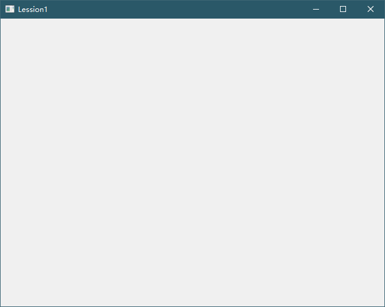

# QT

## 基础知识

### [第一个程序](./Lession1/Lession1.pro)详细解析



<center><b><i>第一个窗口</i></b></center>

#### *`main.cpp`*

```c++
int main(int argc, char *argv[])
{
    QApplication a(argc, argv);
    Widget w;
    w.show();
    return a.exec();
}
```

1. `QApplication a(argc, argv);`

    `QApplication`类是应用程序类，***应用程序对象有且只有一个，并且必须把`main`的参数传给其对象***

2. `Widget w;`

    窗口类，Qt提供了一个`QWidget`类

3. `w.show();`

    显示窗口

2. `a.exec()`应用程序的循环，相当于`while(true)`，当点击窗口的`X`的时候，就相当于结束这个函数

#### *`widget.h`*

1. `Q_OBJECT`

    要使用信号与槽机制，必须包含该宏moc -> ***元对象系统***

#### *`Lession1.pro`*

1. `QT       += core gui`

    项目编译的时候需要加载的模块 

    `core`：核心

    `gui`：graphics user interface，与界面有关的模块

2. `greaterThan(QT_MAJOR_VERSION, 4): QT += widgets`

   当Qt的版本大于Qt4的时候就添加`widgest`模块
   
3. `CONFIG += c++11`
   
   配置：加上C++ 11标准，从而在代码中使用C++ 11标准的特性
   
4. `DEFINES += QT_DISABLE_DEPRECATED_BEFORE=0x060000`

   定义该宏，如果在项目中使用了过时的api（函数），那么会被视为错误
   
   `DEFINES += QT_DEPRECATED_WARNINGS`
   
   定义该宏，如果在项目中使用了过时的api，那么发出警告
   
5. ```properties
   SOURCES += \
   	main.cpp \
   	widget.cpp
   ```
   
    项目中的源文件（.cpp文件）
   
6. ```properties
   HEADERS += \
       widget.h
   ```

   项目中的头文件（.h文件）