# QT

## 基础知识

### [第一个程序](./Lession1/Lession1.pro)详细解析


<center><b><i>第一个窗口</i></b></center>

#### *`main.cpp`*

```c++
int main(int argc, char *argv[])
{
    QApplication a(argc, argv);
    Widget w;
    w.show();
    return a.exec();
}
```

1. `QApplication a(argc, argv);`

    `QApplication`类是应用程序类，***应用程序对象有且只有一个，并且必须把`main`的参数传给其对象***

2. `Widget w;`

    窗口类，Qt提供了一个`QWidget`类

3. `w.show();`

    显示窗口

2. `a.exec()`应用程序的循环，相当于`while(true)`，当点击窗口的`X`的时候，就相当于结束这个函数

#### *`widget.h`*

1. `Q_OBJECT`

    要使用信号与槽机制，必须包含该宏moc -> ***元对象系统***

#### *`Lession1.pro`*

1. `QT       += core gui`

    项目编译的时候需要加载的模块 

    `core`：核心

    `gui`：graphics user interface，与界面有关的模块

2. `greaterThan(QT_MAJOR_VERSION, 4): QT += widgets`

   当Qt的版本大于Qt4的时候就添加`widgest`模块
   
3. `CONFIG += c++11`
   
   配置：加上C++ 11标准，从而在代码中使用C++ 11标准的特性
   
4. `DEFINES += QT_DISABLE_DEPRECATED_BEFORE=0x060000`

   定义该宏，如果在项目中使用了过时的api（函数），那么会被视为错误
   
   `DEFINES += QT_DEPRECATED_WARNINGS`
   
   定义该宏，如果在项目中使用了过时的api，那么发出警告
   
5. ```properties
   SOURCES += \
   	main.cpp \
   	widget.cpp
   ```
   
    项目中的源文件（.cpp文件）
   
6. ```properties
   HEADERS += \
       widget.h
   ```

   项目中的头文件（.h文件）

## 基本组件

### `QtGlobal`

头文件，基础数据类型的定义都在其中

### `QDebug`

头文件，用于输出，可以使用C和C++两种风格的函数

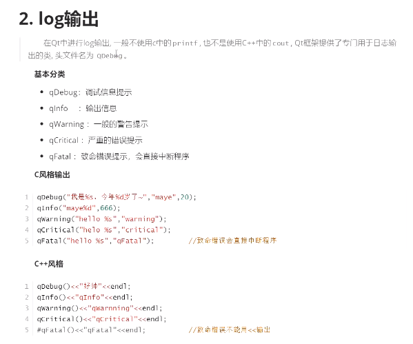

如果不习惯，可以使用`#define cout qDebug()`

### 字符串类型

#### `QByteArray` - C风格字符串

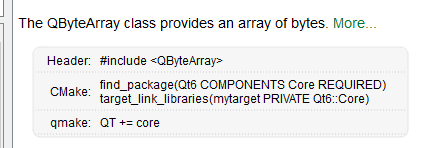

#### `QString` - C++风格字符串

> 使用UTF- 8编码

##### 字符串拼接

```cpp
QDate date = QDate::currentDate();
QString time("%1 %2").arg(date.toString("yyyy/MM/dd")).arg(time.toString("hh:mm:ss"));
```


#### 不同字符串类型相互转换

```cpp
//QString -> QByteArray
//转换为本地编码，跟随操作系统
QByteArray QString::toLocal8Bit() const;
//转换为Latin-1编码，不支持中文
toLatinl() const;
//转换为utf-8字符串
toUTF8() const;

//QByteArray -> QString
//是用构造函数
```

## `QVariant`

> 用于存储任意类型的数据

### 初始化

```cpp
QVariant v(2);
QVariant v1("hello");
QVariant v2(QByteArray("hello"));
```

******

对于自定义类型，`QVariant`使不能直接装的，需要注册：

```cpp
//在类定义好后，在函数外
Q_DECLARE_METATYPE(Animal);
```


### 返回原始类型

```cpp
int temp = v.toInt();
//or
v.value<int>();
```

### 获得类型

- 获得类型名称

```cpp
v.typeName();
```

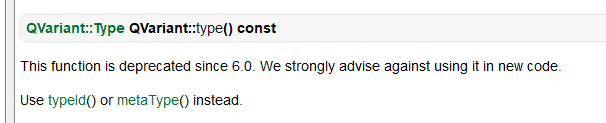

- 获得类型id

```cpp
typeId();
metaType().id();
```

### 判断能否相互转换

```cpp
template <typename T> bool QVariant::canConvert() const
```

## 位置和尺寸

### `QPoint`

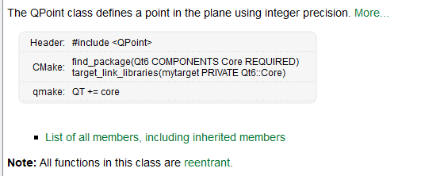

#### 曼哈顿距离

`(p1 - p2).mahnattanLength()`

#### 求点积

`QPoint::dotProduct(p1,p1)`

### `QLine`

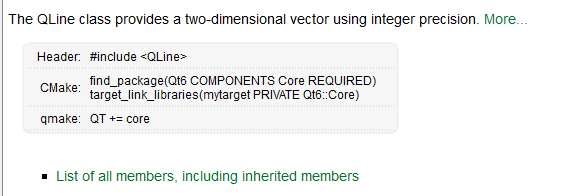

### `QSize`

> 规定一个矩形区域的大小

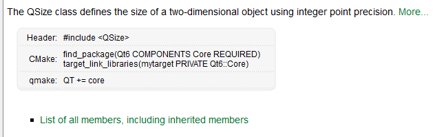

#### 保留两个`qsize`的最大/最小值

```cpp
QSize size1(640,480);
QSize size2(250,2600);
size1.boundedTo(size2);	//返回QSize(250, 480)
size1.expandedTo(size2);//返回Qsize(640, 2600)
```

#### 缩放

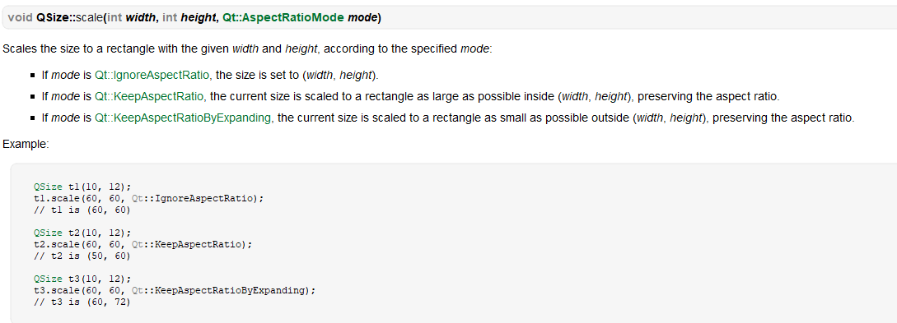


### `QRect`

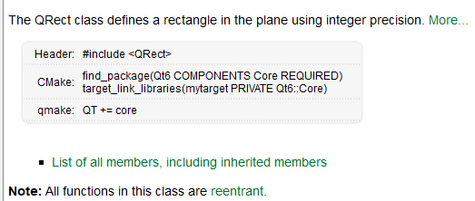

#### `adjust`

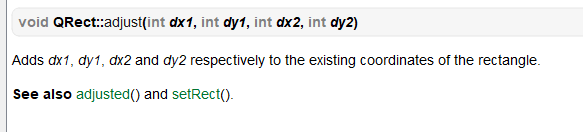

## 日期和时间

### `QDate`

#### `QDateTime`

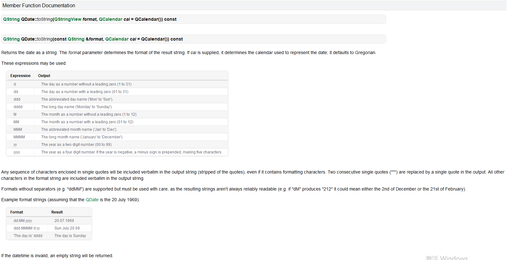

#### 当前时间

`[static] QDate QDate::currentDate()`

### `QTime`

> 经时计时器，推荐使用`QElapsedTimer`

#### `QTime`

```cpp
//开始计时
void QTime::start();
//计时结束
int QTime::elapsed() const;
//重新计时
int QTime::restart();
```

#### `QElapsedTime`

```cpp
void QElapsedTime::start();
qint64 QElapsedTime::restart();
qint64 QElapsedTime::eplapsed() const;
```

### `QDateTime`

> QDateTime是类QDate和类QTime的相结合，它可以从系统时钟中读取当前日期时间。它提供比较日期时间和操作日期时间的函数，比如加上一定数量的秒、天、月或年。

## Container

> QList不是链表，而是数组。
>
> 当存入的元素大小较小时，直接存入数组；
>
> 当存入的元素大小较大时，在堆中申请空间并存储元素的指针

## 信号与槽

### 按钮测试

```cpp
MainWindow::MainWindow(QWidget *parent)
    : QMainWindow(parent)
{
    //不要创建栈区的变量，因为构造函数执行完毕，内存立马会释放
    //empty construction
    QPushButton* btn = new QPushButton();
    //以独立窗口进行显示组件，如果没有设置父对象，那么会创建独立的按钮
    //btn->show();
    //设置父对象，如果父对象显示，那么该组件也会自动显示
    btn->setParent(this);
    btn->setText("第一个按钮");

    //通过构造函数设置父对象，会使窗口以字组件的大小进行调整
    QPushButton* btn2 = new MyPushButton("第二个按钮",this);
    //第一个按钮和第二个按钮会发生重叠，因此要进行移动
    btn2->move(100,0);
    //重新设置窗口的大小
    this->setWindowTitle("按钮测试");
    this->resize(640,480);
}
```

<center><b><i>申请了内存，但是没有释放</i></i></b></center>

### 信号与槽机制

> 信号和槽之间不是一一对应的关系。一个信号可以对应多个槽，比如点击一个按钮可以触发多个不同的响应；一个槽也可以响应多个不同的信号，比如点击按钮可以关闭窗口，点击左上角的小叉也可以关闭窗口。信号和槽之间只要通过connect 函数连接就建立了耦合关系，如果想解除连接可以使用disconnect 函数。
>
> 槽是普通的 C++ 成员函数，可以被正常调用，它们唯一的特殊性就是很多信号可以与其相关联。当与其关联的信号被发射时，这个槽就会被调用。槽可以有参数，但槽的参数不能有缺省值。
>
> 既然槽是普通的成员函数，因此与其它的函数一样，它们也有存取权限。槽的存取权限决定了谁能够与其相关联。同普通的 C++ 成员函数一样，槽函数也分为三种类型，即 public slots、private slots 和 protected slots。

#### 快速上手

```cpp
//信号：什么时候触发？	进行对应的操作
    //槽函数：接收到信号之后，应该做的事情
    //信号与槽机制：松散耦合关系，谁关心这个信号，谁就去处理
    //信号与槽：可以属于不同的对象，也可以属于相同的对象
    //使用QObject::connect函数建立信号与槽的关联
    QPushButton* btn = new QPushButton("press me", this);
    
    //接受按钮的点击信号，关闭这个窗口
    connect(btn, QPushButton::clicked,this,MainWindow::close);
```


#### 函数声明

```cpp
[static] QMetaObject::Connection 
    QObject::connect(const QObject *sender, 
                     const char *signal, 
                     const QObject *receiver, 
                     const char *method, 
                     Qt::ConnectionType type = Qt::AutoConnection)
```

#### 槽定义

```cpp
//MainWindow.h
class MainWindow : public QMainWindow
{
    //槽定义
public slots:
 	void onClicked();
}

//MainWindow.cpp
void MainWindow::onClicked()
{
    qDebug() << "button pressed";
}
```

#### 槽使用

```cpp
//关联信号与槽
    /*
     * sender   信号的发出者
     * signal   什么信号
     * receiver 信号接收者
     * method   对应的信号处理函数
     */
    connect(btn2, QPushButton::clicked, this, MainWindow::onClicked);
    connect(btn2, QPushButton::pressed, this, MainWindow::onClicked);
```

#### ***案例***

按下按钮`我饿了`，控制台打印`多喝热水`

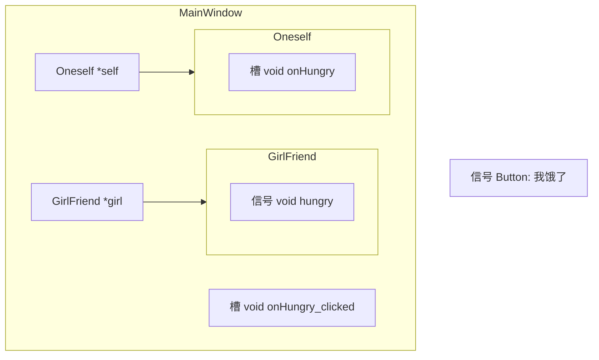

##### 思路

###### 通过信号触发槽，槽再触发信号

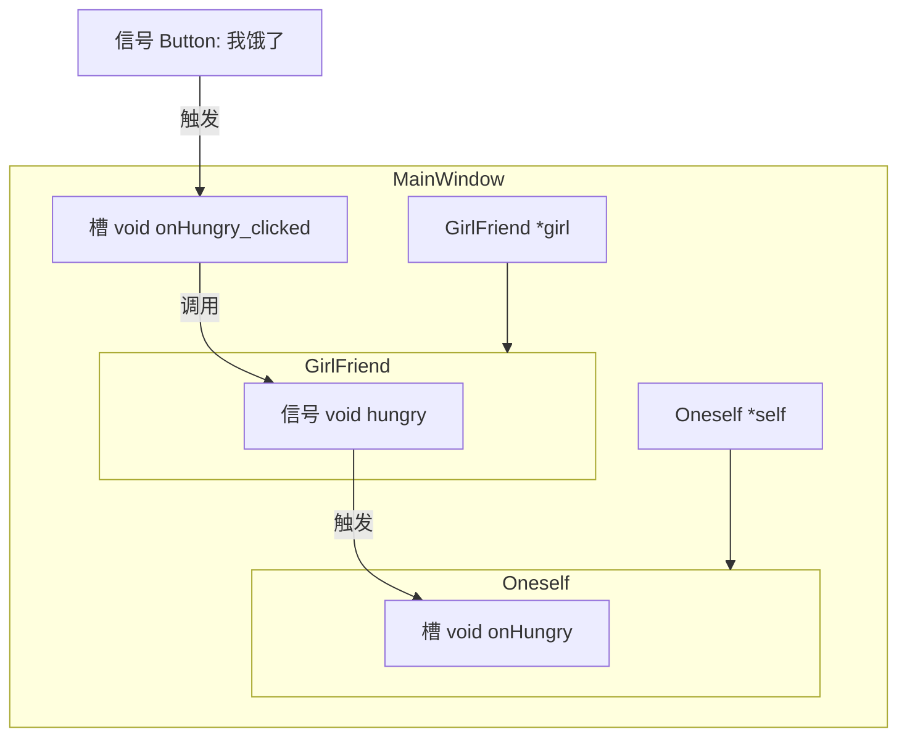

###### 通过信号触发信号

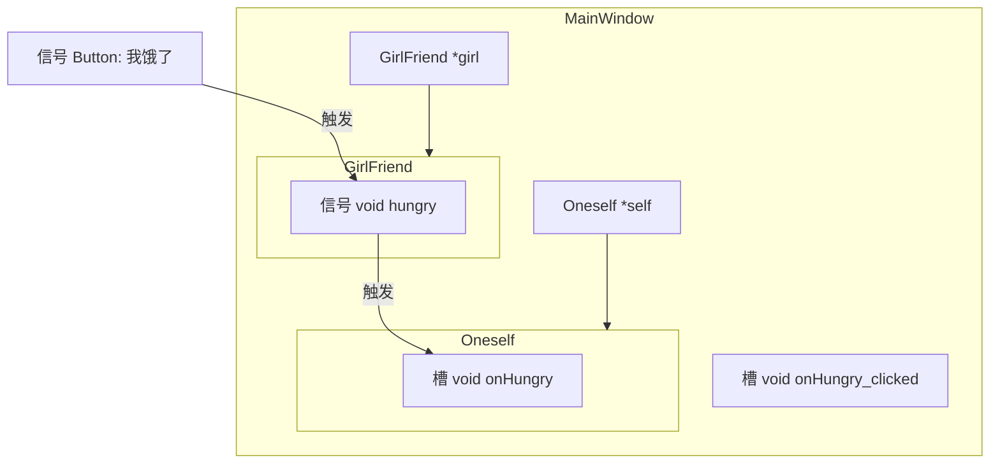

##### 代码

###### `girlfriend`

```cpp
class GirlFriend : public QObject
{
    //如果想要使用信号与槽机制，就需要加上这个宏
    Q_OBJECT
public:
    explicit GirlFriend(QObject *parent = nullptr);
    
//定义信号，必须在signals下定义
//信号只是函数的声明，但是不可以实现，Qt框架在预编译的时候自动为我们实现
signals:
    //饿了信号
    void hungry();   
};

GirlFriend::GirlFriend(QObject *parent)
    : QObject{parent}
{
    
}
```

###### `oneself`

```cpp
class Oneself : public QObject
{
    Q_OBJECT
public:
    explicit Oneself(QObject *parent = nullptr);
    
//自定义槽函数，一般会写在public slots下面
public slots:
    //槽的名字是信号的名字前加on
    void onHungry();
    
signals:
    
};

Oneself::Oneself(QObject *parent)
    : QObject{parent}
{
    
}

void Oneself::onHungry()
{
    qDebug() << "多喝热水";
}
```

###### `mainwindow`

```cpp
class MainWindow : public QMainWindow
{
    Q_OBJECT
    
public:
    MainWindow(QWidget *parent = nullptr);
    ~MainWindow();
    
public slots:
    void onHungry_clicked();
    
private:
    GirlFriend *_girl;
    Oneself    *_self;
};

MainWindow::MainWindow(QWidget *parent)
    : QMainWindow(parent)
{
    //分配内存
    this->_girl = new GirlFriend(this);
    this->_self = new Oneself(this);
    //连接信号与槽
    connect(this->_girl, GirlFriend::hungry, this->_self, Oneself::onHungry);
    
    //通过一个按钮触发信号
    QPushButton* button_hungry = new QPushButton("我饿了",this);
    //思路1
    //将button连接到this->_girl->hungry，再通过另一个connect触发槽onHungry
    connect(button_hungry, QPushButton::clicked, this, MainWindow::onHungry_clicked);
    
    //思路2
    //直接连接，不需要两个connect
    //信号不仅仅与槽建立关联，还可以与信号进行关联
    connect(button_hungry, QPushButton::clicked, this->_girl, GirlFriend::hungry);
}
```

#### 带参信号

***信号与槽参数匹配问题***

1. 信号返回值是`void`	参数可以任意指定
2. 槽的返回值是`void`	参数可以任意指定
3. 建立关联的信号与槽参数必须满足以下条件：
	
	1.	信号的参数一般和槽函数一样（类型一样，顺序一样）
	2.	信号的参数可以比槽函数的参数多，但是不可以比槽函数少
	2.	槽函数的默认参数不能被忽略，必须一一传参

### 重载信号


