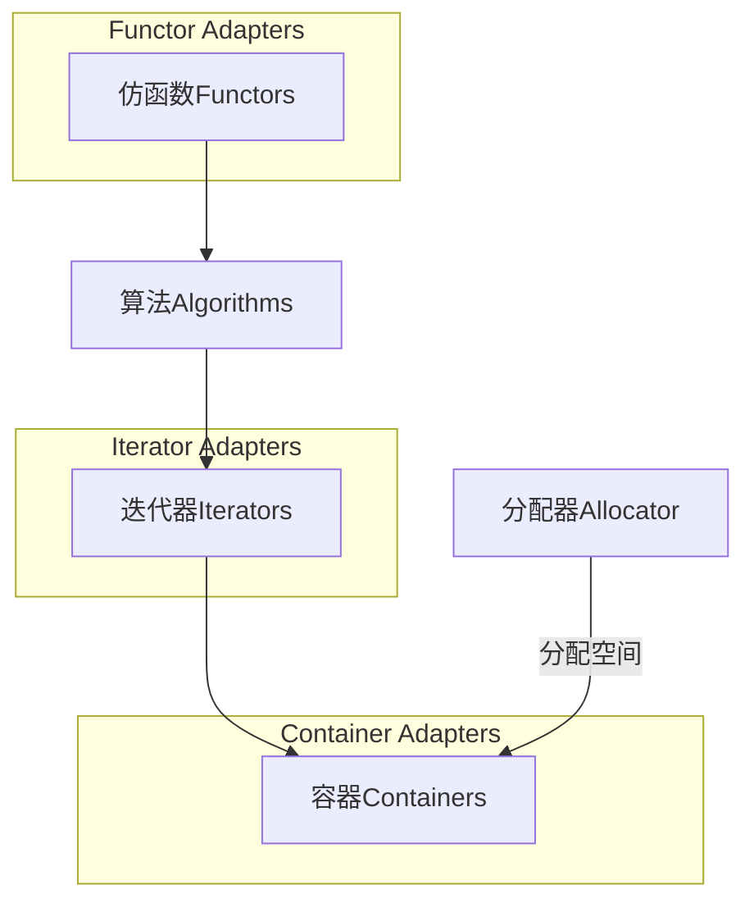
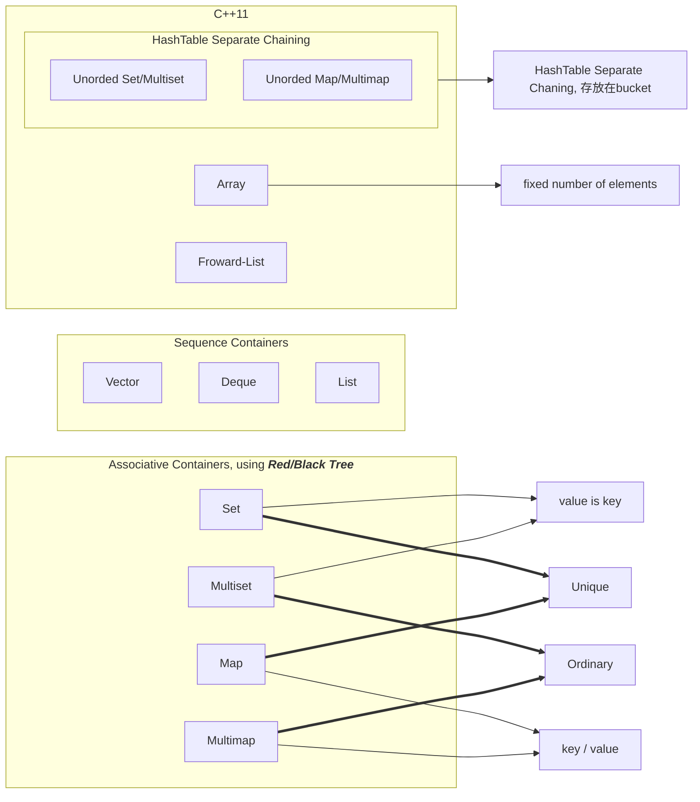

# STL与泛型编程

> C++标准库 - 体系结构与内核分析
>
> 使用一个东西,却不明白它的道理,不高明!

## 引入

### 应该具备的基础

- C++基本语法(包括如何正确使用模板,template)


### 目标

1. level 0 : 使用C++标准库
2. level 1 : 认识C++ 标准库(***胸中有丘壑***)
3. level 2 : 良好使用C++标准库
4. level 3 : 扩充C++标准库(不是很必要)


### C++ Standard Library *vs*. Standard Template Library

 在整个C++标准库中,STL占据了70~80%的部分. 而STL又由六大部件组成


标准库以head files形式呈现

- C++标准库的head file不带`.h`, 例如`#include<vector>`
- 新的C head files不带`.h`, 例如`#include<cstdio>`
- 旧的C head files带`.h`, 例如`#include<stdio.h>`


### 重要网页

1. http://www.cpluscplus.com
2. http://cppreference.com
3. https://gcc.gnu.org


### 书推荐

1. ***The C++ Standard Library - A Tutorial and Reference***
2. ***STL源码剖析***

## STL体系结构基础介绍

### ***STL六大部件（Components）***

- 容器（Containers）
- 分配器（Allocators）
- 算法（Algorithms）
- 迭代器（Iterators）
- 适配器（Adapters）
- 仿函数（Functors）



******

### ***复杂度（Complexity，Big-oh）***

目前常见的Big-oh有下列几种情形（n必须是一个很大的数量）：

1. $$
    O(1) / O(c)：称为常数时间（constant\; time）
    $$

2. $$
    O(n)：称为线性时间（linear\; time）
    $$

3. $$
    O(log_{2}{n})：称为次线性时间(sub-linear\; time)
    $$

4. $$
    O(n^2)：称为平方时间（quadratic\;time）
    $$

5. $$
    O(n^3)：称为立方时间（cubic\; time）
    $$

6. $$
    O(2^n)：称为指数时间(exponential\; time)
    $$

7. $$
    O(nlog_{2}{n})：介于线性及二次方成长的中间的行为模式
    $$

******

### “前闭后开”区间

### range-based for statement (since C++11)

```c++
for(decl : coll) 	//decl:declaration	coll:collection
{
    statement
}
```

```c++
std::vector<double> vec;

//在不需要操作元素本身的时候不需要引用（详见《C++ Primer(5th edition)》）
for( auto elem : vec)
{
    std::cout << elem << std::endl;
}
//在需要操作元素本身的时候使用引用
for( auto& elem : vec )
{
    elem *= 3;
}
```

******

### auto keyword

原本写法：

```c++
list<string> c;
...
list<string>::iterator ite;
ite = ::find(c.begin(), c.end(), target);
```

C++11写法：

```c++
list<string> c;
...
auto ite = ::find(c.begin(), c.end(), target);
```

## 容器之分类与各种测试

### 容器——结构与分类



### 使用容器

#### 写测试程序的习惯

1. 将一段独立的单元放在一段独立的命名空间中
2. 将包含的头文件放在命名空间的上面
3. 在用到变量的时候再去声明，并且与其他代码之间少一个tab，方便寻找

