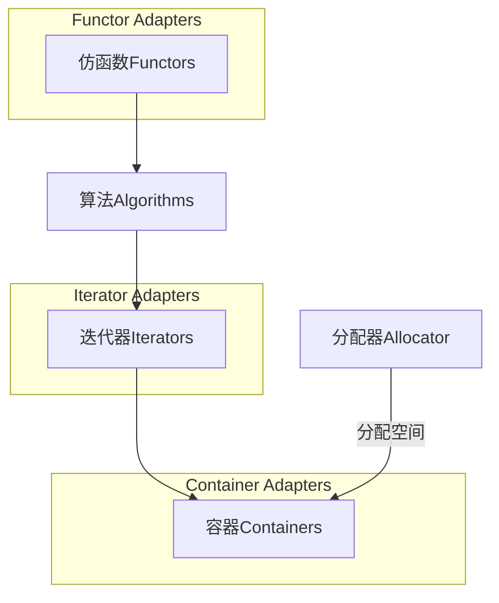
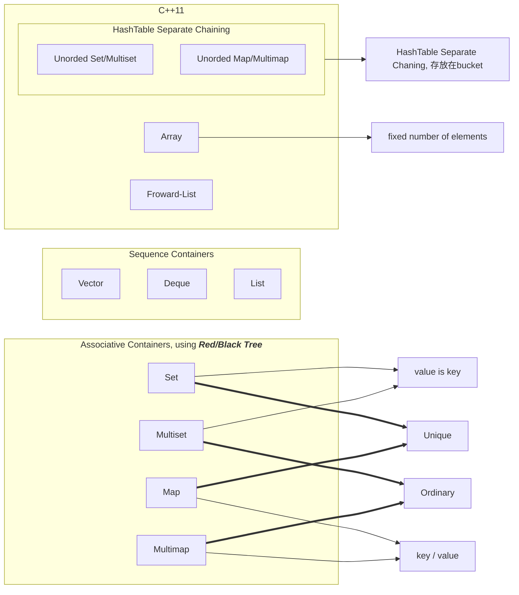

# STL与泛型编程

> C++标准库 - 体系结构与内核分析
>
> 使用一个东西,却不明白它的道理,不高明!

## 引入

### 应该具备的基础

- C++基本语法(包括如何正确使用模板,template)


### 目标

1. level 0 : 使用C++标准库
2. level 1 : 认识C++ 标准库(***胸中有丘壑***)
3. level 2 : 良好使用C++标准库
4. level 3 : 扩充C++标准库(不是很必要)


### C++ Standard Library *vs*. Standard Template Library

 在整个C++标准库中,STL占据了70~80%的部分. 而STL又由六大部件组成


标准库以head files形式呈现

- C++标准库的head file不带`.h`, 例如`#include<vector>`
- 新的C head files不带`.h`, 例如`#include<cstdio>`
- 旧的C head files带`.h`, 例如`#include<stdio.h>`


### 重要网页

1. http://www.cpluscplus.com
2. http://cppreference.com
3. https://gcc.gnu.org


### 书推荐

1. ***The C++ Standard Library - A Tutorial and Reference***
2. ***STL源码剖析***

## STL体系结构基础介绍

### ***STL六大部件（Components）***

- 容器（Containers）
- 分配器（Allocators）
- 算法（Algorithms）
- 迭代器（Iterators）
- 适配器（Adapters）
- 仿函数（Functors）



******

### ***复杂度（Complexity，Big-oh）***

目前常见的Big-oh有下列几种情形（n必须是一个很大的数量）：

1. $$
    O(1) / O(c)：称为常数时间（constant\; time）
    $$

2. $$
    O(n)：称为线性时间（linear\; time）
    $$

3. $$
    O(log_{2}{n})：称为次线性时间(sub-linear\; time)
    $$

4. $$
    O(n^2)：称为平方时间（quadratic\;time）
    $$

5. $$
    O(n^3)：称为立方时间（cubic\; time）
    $$

6. $$
    O(2^n)：称为指数时间(exponential\; time)
    $$

7. $$
    O(nlog_{2}{n})：介于线性及二次方成长的中间的行为模式
    $$

******

### “前闭后开”区间

### range-based for statement (since C++11)

```c++
for(decl : coll) 	//decl:declaration	coll:collection
{
    statement
}
```

```c++
std::vector<double> vec;

//在不需要操作元素本身的时候不需要引用（详见《C++ Primer(5th edition)》）
for( auto elem : vec)
{
    std::cout << elem << std::endl;
}
//在需要操作元素本身的时候使用引用
for( auto& elem : vec )
{
    elem *= 3;
}
```

******

### auto keyword

原本写法：

```c++
list<string> c;
...
list<string>::iterator ite;
ite = ::find(c.begin(), c.end(), target);
```

C++11写法：

```c++
list<string> c;
...
auto ite = ::find(c.begin(), c.end(), target);
```

## 容器之分类与各种测试

### 容器——结构与分类



### 使用容器

#### 1.	使用容器array

```cpp
#include<array>
#define ASIZE 500000

void test_array()
{
    cout << "\ntest_array()..........\n";
    
array<long,ASIZE> c;
     
clock_t timeStart = clock();
    for(long i = 0; i < ASIZE ; ++i)
    {
        c[i] = rand();
    }
    cout << "milli-seconds: " << (clock() - timeStart) << endl;
    cout << "array.size()= " << ASIZE << endl;
    cout << "array_front()= " << c.front() << endl;		//第一个元素
    cout << "array_back()= " << c.back() << endl;		//最后一个元素
    cout << "array.data()= " << c.data() << endl;		//返回array在内存的起点地址
}
```

##### 写测试程序的习惯

1. 将一段独立的单元放在一段独立的命名空间中
2. 将包含的头文件放在命名空间的上面
3. 在用到变量的时候再去声明，并且与其他代码之间少一个tab，方便寻找

#### 2.	使用容器vector

vector的容量（capacity）是两倍增长和减少的

```cpp
#include <vector>
#include <stdexcept>
#include <string>
#include <cstdlib>
#include <cstdio>
#include <iostream>
#include <ctime>
#include <algorithm>

namespace jj02
{
    void test_vector(long& value)
    {
        cout << "\ntest_vector..........\n";

    std::vector<string> c;
    char buf[10];

    clock_t timeStart = clock();
        for(long i = 0; i < value ; ++i)
        {
            try
            {
                snprintf(buf , 10 , "%d" , rand());		//将数字变为字符串
                c.push_back(string(buf));
            }
            catch(exception& p)	//std::bad_alloc
            {
                cout << "i=" << i << p.what() << endl;
                abort();		//出现异常，通过abort退出程序
            }
        }

        cout << "milli-seconds: " << (clock() - timeStart) << endl;
        cout << "vector.size()= " << c.size() << endl;		//包含的元素
        cout << "vector.front()= " << c.front() << endl;
        cout << "vector.back()= " << c.back() << endl;
        cout << "vector.data()= " << c.data() << endl;		//内存中的首地址
        cout << "vector.capacity()= " << c.capacity() << endl;	//目前的容量
        
        string target = get_a_target_string();
        //find algorithms
        {
            auto pItem = ::find(c.begin(),c.end(),target);
        	...
        }
        //sort,binary-search algorithms
        /*
        void* bsearch (const void* key, const void* base,
               size_t num, size_t size,
               int (*compar)(const void*,const void*));
        */
        {
            sort(c.begin(),c.end());
            string* pItem = (string*)bsearch(&target, (c.data()) , c.size(), sizeof(string),/*some function pointer to compare string*/)
        }
    }
}
```

