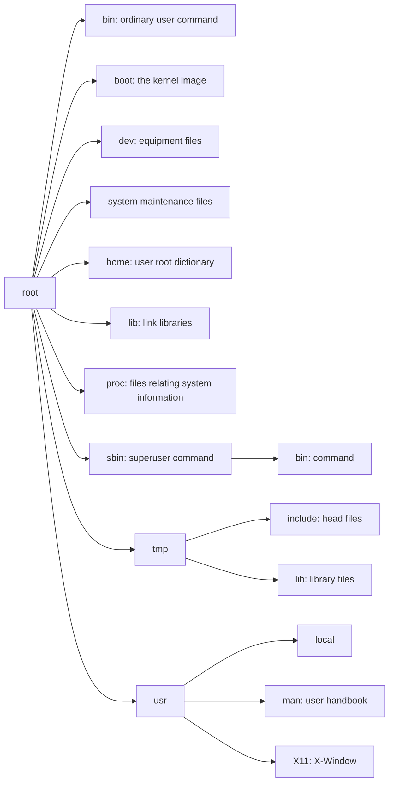

# System Programming in Unix/Linux

[TOC]

## Introduction

**My interests**:

1. the usage of Assembler, encoder, Linker, Link Library.
2. the definition of process, process management
3. concurrent programming

### the file system organization of Unix/Linux



In a general sense, each node in the file system tree is a *FILE*. In Unix/Linux, files are classified as following:

1. File
   1. catalog file

      A catalog may contain other catalogs and non-catalog files

   2. Non-catalog file

      Non-catalog files are ***Regular*** files or ***Special*** files , but they can only be the nodes in the file system tree. They can be classified as:
      
      * ***Ordinary Files***: They either are ordinary text file or contain executable bin codes.
      
      * ***Special Files***: They are items in `/dev`. They are I/O equipments:
        
         * ***Character Special File***: I/O of characters, such as `/dev/tty0`, `/dev/pts/1` and so on.
         * ***Block Special File***: I/O of blocks, such as `/dev/had`, `/dev/sda` and so on.
         
      * ***Symbolic Link Files***: They are ordinary files and contain the paths of other files. Thus, they are the pointers to other files.
      
         ```shell
         ln -s aVeryLongFileName myLink
         ```
         
         
         > This will create a *Symbolic Link File* `myLink`, which points `aVeryLongFileName`. The visit to `myLink` will be redirected to the specified file `aVeryLongNameFile`.

2. File Pathname
   
   The root node of Unix/Linux file system tree is called **root dictionary**, or **root** for short. Each nodes in the file system tree is assigned in the form as follows:
   
   ```shell
   /a/b/c/d or a/b/c/d
   ```
   
   **Absolute pathnames** begin with `/`, while **Relative pathnames** are for process in **Current Work Dictionary*(CWD)***. *CWD* is set as the root dictionary of the user when log in. *CWD* can be changed by `cd` and command `pwd` can print the **Absolute pathname** of *CWD*.
   
### Unix/Linux Commands

***common commands***:

* `ls`: ls dirname: list the content of *CWD* or dictionary
* `cd dirname`: change dictionary
* `pwd`: print the absolute pathname of *CWD*
* `touch filename`: change the timestamp of filename, if the file doesn't exist, then create it
* `cat filename`: show the content of file
* `cp fileName dest`: copy file
* `mv fileName dest`: move file
* `mkdir dirname`: mkdir(make dictionary) dirname(dictionary name), create dictionary
* `rmdir dirname`: remove empty dictionary, if the dictionary is not empty, the delete instruction won't succeed
* `ln oldFile newFile`: create links between files, the `newFile` can't exist
* `find`: search files
* `grep`: search for lines in files that contain patterns 

### Linux Handbook

`/usr/share/man`

### Ubuntu Linux system management

#### create new user

`sudo adduer username`

#### `sudo`command

Ubuntu forbids `root` and `superuser`, for no one can log in with root identification(Though there is still one way but not listed).

`sudo`(*super user do*) allows user execute command with another identification(usually superuser). To make sure use of `sudo`,the user name must be contained in `/etc/sudoers` file. To make sure the use of `sudo`, just add the following line in `sudoers`:

`username ALL(ALL)	ALL`

However, the format of `/etc/sudoers` files are strict for any mistake may breach system's safety. Linux only suggest to edit the file with command `visudo`,which calls *vi editor* and requires check and verification.


## Programming Background

### Text editors in Linux

1. Vim
   Different from other text editors, vim has 3 different operating mode:
   
      * command mode: to input command
      * insert mode: to insert and edit text
      * last line mode: to save file and quit
   
   When vim is on, it is faultily `command mode`, in this mode, most keys represent special commands. 
   | key | meaning |
   |-----|---------|
   |  h  |move the cursor one character to left|
   |  l  |right|
   |  j  |move the cursor down one line|
   |  k  |move the cursor up one line|
   
   To quit `command mode`, press **ESC** once or many times as needed. To input text and edit, user need to input `i` or `a` to switch vim into `insert mode`
   
   * i: switch to `insert mode`, insert text
   * a: switch to `insert mode`, append text

   To quit `insert mode`, press `ESC` once or many times as needed. Press `:` to switch into `last line mode` in `command mode`
   
   * w: write(save)file
   * q: quit vim
   * wq: save and quit
   * q!: don't save, force quit

2. gedit
   gedit is the default text editor in GNOME desk environment. 
   
3. emacs
   `emacs fileName`
   
### use text editor

1. use emacs
   **save**: ctrl + x + c

2. emacs menu
3. IDE of emacs

### Program development

**The steps of program development**

   1. create source file: use text editor(gedit or emacs) to create program source file(s).
   
   2. transform source files into binary files with gcc
   
      ```shell
      gcc t1.c t2.c
      ```
   
   3. What is gcc?
      
      gcc is a program, which includes 3 steps:
      ```mermaid
       graph LR;
      	t1.c -->|compiler| t1.s
      		t1.s -->|assembler| t1.o
      			t1.o -->|linker - C library| a.out
      	t2.c -->|compiler| t2.s
      		t2.s -->|assembler| t2.o
      			t2.o -->|linker - C library| a.out
      ```
      
      **First step**: 
         transform C source file into assembly code: .c -> .s
      
      **Second step**:
         transform assembly code into destination code(.o), each .o file contains:
      
         * **a file head**, contains the size of code snippet, data segment and BSS（**Block started by symbol**）segment
         * **a code snippet**, containing machine instructions
         * **a data segment**, containing initialized global variables and initialized static variables
         * **a BBS segment**, containing uninitialized global variables and uninitialized static variables (or initialized as 0), before the start of program, they will be set as 0
      
      **Third step**:
         Link. A program may contain many .o files relying on each other. Besides, .o files may call C library functions, such as `printf()`, which doesn't exit in source files. The last step of cc is call linker, which links all .o files and necessary into a single binary executable file.
      
      In detail:
      
         * combine all code snippet in .o files into a single code snippet. For C program, the combined code snippet starts from default C start-up code, which calls function `main()`. This is why each C program must contain an unique 	`main()`
         * combine all the data segments into one. It only contains initialized global variables and local variables.
         * combine all the BSS segments into one 
         * Use the relocation information in .o files to adjust the pointer in the combined code and the offset in the combined data segment and BSS segment
      
### Static and Dynamic Linking

There are two ways to create runable binary files: static linking and dynamic linking. 

1. Linker puts all necessary library function codes and data in `a.out` in static linking with static library.
2. When execute `a.out` file with dynamic linking, operating system load `a.out` and shared library into internal storage, which makes loaded library codes can be visited by `a.out` during execution. The advantages of dynamic linking:
   * decrease the size of each `a.out` file
   * many running programs can share the library functions in common in the internal storage

### executable file layout

Though the default layout of binary executable files is `a.out`, the file layout is changeable. Most C compilers and linkers can generate multiple different executable files inluding:

* binary executable flat files

    it only contains executable codes and initialized data. The file will be loaded into the internal storage as whole, which is easy to execute directly

* `a.out`executable files

    see [the details of `a.out`](#the details of `a.out`)

* ELF executable files

    it contains one or more program segment. Each program segment can be loaded into specific internal storage address. In Linux, the default binary executable file layout is ELF files, for they are more suitable for linking

### the details of `a.out`

`a.out`file includes:

1. **file head**: contains the loading information and size
    - tsize = the size of code segment
    - dsize = contains the size of data segment containing initialized global variables and initialized static local variables
    - bsize = contains the size of BSS segment
    - total_size = the total size of loaded `a.out` file
2. **code segment**: which is called **text sections** which contains executable codes of the program. The code segment starts with `crt0.o`, which calls `main()` function
3. **data segment**: contains initialized global variables and initialized static vatiables
4. **symbol table**: optional, only for debugging purpose

**attention**: BBS segment is not contained in `a.out`. Only the size of it is recorded in the file head

### the progress of program execution

 

### the end of program

two ways to end executing program:

1. **propertermination**: if the execution of the program successed, `main()` will finally return `ctr.o`, call library function `exit(0)` to terminate the process. Firstly, `exit(value)` will do some clean-up work, such as refresh stdout, shut off I/O, etc. ...
2. **abnormal termination**: When execute `a.out`, the process might encounter errors, such as invalid address, illegal instruction, unauthorized operation , etc. These erorrs will be recognized as **exception**. ...

## Function call in C language

***program example***

```cpp
int sub(int x, int y)
{
	int u,v;
	u = 4;
	v = 5;
	return x+y+u+v;
}

int main()
{
	int a,b,c;
	a = 1;
	b = 2;
	c = sub(a, b);
	printf("c=%d\n",c);
}
```
## Link Library

### static link library

```shell
gcc -c file1.c                                  # compile .c files into .o files
gcc -c file2.c
gcc -c file3.c
ar -rc liballfiles.a file1.o file2.o file3.o    # create static link library with member ,. files
gcc main.c -L. -lallfiles -o out                # static compile-link main.c with libmylib.a as link library
a.out                                           # run a.out as usual
```

In the process of compilation and execution, `-L.` specifies the link library path(current dictory), `-l` sprcifies link librarys.

### dynamic link library

```shell
gcc -c -fPIC file1.c                # compile to Position Independent Code file1.o
gcc -shared -o libmylib.so file1.o  # create shared libmylib.so with mysum.o
gcc main.c -L. -lmylib              # generate a.out using shared library libmylib.so
export LD_LIBRARY_PATH=./           # to run a.out, must export LD_LIBRARY=./
./a.out                             # run a.out. ld will load libmylib.so
```

OR

```shell
gcc -shared -fPIC file1.c -o libfile1.so
gcc -shared -fPIC file2.c -o libfile2.so
gcc -shared -fPIC file3.c -o libfile3.so
gcc main.c -L. -lfile1 -lfile2 -lfile3 -o out
```

## makefile

### makefile格式

一个`make`文件由一系列**目标项**/**依赖项**和**规则**组成.

目标项通常是要创建或更新的文件,而它也可能是make程序要引用的指令或标签,但它也可能是make程序要引用的指令或标签.目标项依赖于一系列源文件/目标文件甚至其它目标项,具体描述见[依赖项列表](#依赖项列表)

规则是使用依赖项列表构建目标项所需的命令

| 目标项  | <a name="依赖项列表">依赖项列表</a> |
| ------- | ----------------------------------- |
| target: | file1 file2 ... fileN               |
|         | 规则                                |
| `<tab>` | command1                            |
| `<tab>` | command2                            |
| `<tab>` | other command                       |

<center style="color:#C0C0C0";text-decoration:underline">makefile格式</center>

### make程序

假设一个C语言程序包含三个源文件:

1. ```c
    //type.h file:
    int mysum(int x,int y);
    ```

2. ```c
    //mysum.c file
    #include<stdio.h>
    #include"type.h"
    int mysum(int x,int y)
    {
        return x + y;
    }
    ```

3. ```c
    //t.c file
    #include<stdio.h>
    #include"type.h"
    int main()
    {
        int sum = mysum(123,456);
        printf("sum = %d\n",sum);
    }
    ```

通常,我们会使用命令:`gcc -o myt main.c mysum.c` 生成一个名为myt的二进制可执行文件.


### makefile实例

#### 实例1

> 可以看到，mk1是一个非常简单的makefile，它与sh命令的差别不大

1. 创建一个名为mk1的makefile

    ```makefile
    myt: type.h t.c mysum.c			# target: dependency list
    	gcc -o myt t.c mysum.c		# rule: line MUST begin with a tab
    ```

    在本示例中，生成的可执行文件名myt通常与目标项名称相匹配。这允许make通过将目标项时间辍与依赖项列表中的时间辍进行比较，来决定稍后是否再次构建目标项

2. 使用mk1作为makefile运行make：make通常使用默认的makefile或Makefile，及当前目录中出现的makefile。它可以通过`-f`标志直接使用另外一个makefile，如：

    ```shell
    make -f mk1
    ```

3. 再次运行make命令，将会显示消息：

    ```shell
    make: 'myt' is up to date
    ```

    在这种情况下，make不会再次构建目标，因为在上次构建后没有任何文件更改

4. 相反，如果依赖项列表中的任何文件有更改，make将再次执行rule命令。例如

    ```shell
    touch type.h
    ```

    make将重新编译链接源文件，以生成新的myt文件

#### 实例2

```makefile
CC = gcc            # define CC as gcc
CFLAGS = -Wall      # define CFLAGS as flags to gcc
OBJS = t.o mysum.o  # define Object code files
INCLUDE = -Ipath    # define path as an INCLUDE directory
 
myt: type.h $(OBJS) # traget: dependency: type.h and .o files
	$(CC) $(CFLAGS) -o t $(OBJS) $(INCLUDE)
```

1. 在makefile中，宏定义的符号——$（符号）被替换为它们的值。

2. 对于依赖项列表中的每个.o文件，make会首先将相应的.c文件编译为.o文件。

    - 但是，这只适用于.c文件
    - 由于所有的.c文件都依赖于.h文件，所以必须在依赖项列表中显式地包含type.h（或其他任何.h文件）

    或者，我们可以定义其他目标项来指定.o文件对.h文件的依赖关系，如：

    ```makefile
    t.o:		t.c type.h		# t.o depend on t.c and type.h
    	gcc -c t.c
    mysum.o:	mysum.c type.h	# mysum.o depend type.h
    	gcc -c mysum.c
    ```

    > 如果将上述目标项添加到makefile中，.c文件或type.h中的任何更改都将触发make重新编译.c文件。
    >
    > 如果.c文件的数量很小，则会很有效。如果.c文件的数量很大，则会很繁琐

3. 以mk2作为makefile运行make

    ```shell
    make -f mk2
    ```


#### 实例3——按名称(即命令标签)编译目标

```makefile
# ------------------------------ mk3 file ------------------------------
CC = gcc					# define CC as gcc
CFLAGS = -Wall				# define CFLAGS as flags to gcc
OBJS = t.o mysum.o			# define Object code files
INCLUDE = -Ipath			# define path as an INCLUDE directory

# ----------------------------------------------------------------------
# 个人笔记：
# 所谓的all: / myt: t/o: 等等，可以理解为一个命令标签，运行这些命令会运行下面用tab开头的所有指令
# 例如，all将会运行myt/install命令
# 		myt将会调用t.o和mysum.o两个.o文件，然后make就会编译t.cpp和mysum.cpp
# ----------------------------------------------------------------------
all: myt install			# build all listed targets: myt, install

myt: t.o mysum.o			# target: dependency list of .o files
	$(CC) $(CFLAGS) -o myt $(OBJS) $(INCLUDE)
	
t.o:	t.c type.h			# t.o depend on t.c and type.h
	gcc -c t.c
mysum.o: mysum.c type.h		# mysum.o depend mysum.c and type.h
	gcc -c mysum.c

install: myt				#depend on myt: make will build myt first
	echo install myt to /usr/local/bin
	sudo mv myt /usr/local/bin/	#install myt to /usr/local/bin

run: install				# depend on install, which depend on myt
	echo run executable image myt
	myt || /bin/true		# no make error 10 if main() return non-zero
	
clean:
	rm -f *.o 2> /dev/null	# rm all *.o files
	sudo rm -f /usr/local/bin/myt
```

可以通过以下语句运行对应命令标签：

1. ```shell
    make all -f mk3
    ```

2. ```shell
    make install -f mk3
    ```

3. ```shell
    make run -f mk3
    ```

4. ```shell
    make clean -f mk3
    ```

    

#### makefile变量

makefile中，%是一个与sh中的*类似的通配符变量。makefile还可以包含**自动变量**：

- $@：当前目标名
- $<：第一个依赖项名
- $^：所有依赖项名
- $*：不包含拓展名的当前依赖项名
- $?：比当前目标更新的依赖项列表

另外，make还支持**后缀规则**。

## GDB调试工具

> man gdb


