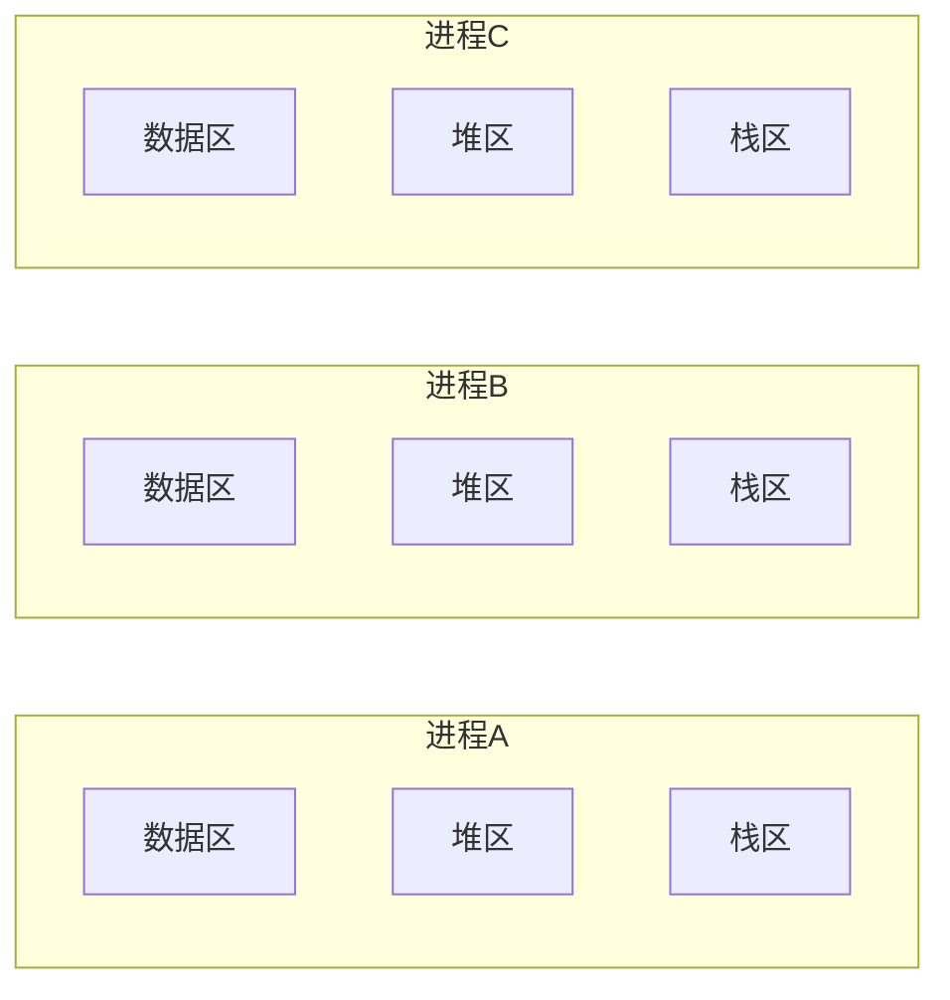
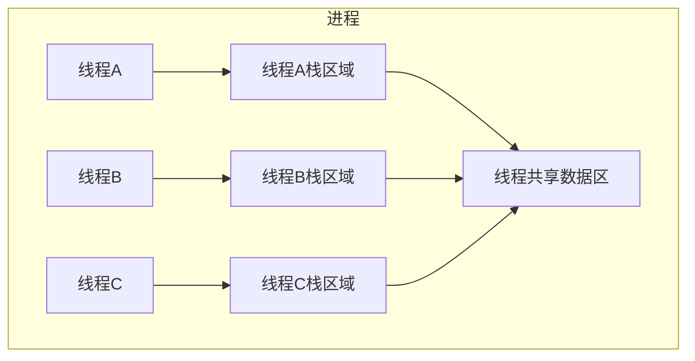
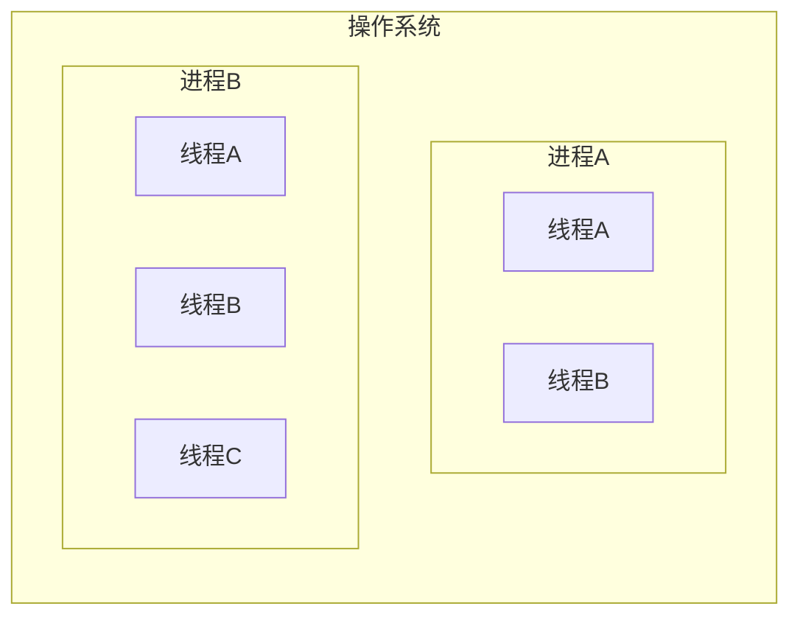
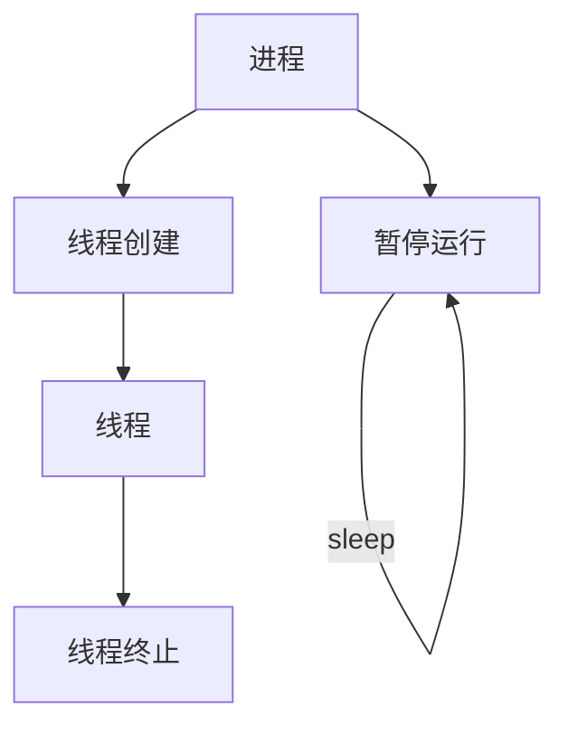

[TOC]

# 理解线程的概念

## 线程产生的背景

创建进程（复制）的工作本身会给操作系统带来相当沉重的负担。而且每个进程具有独立的内存空间，所以进程间通信的实现难度也会随之提高。换言之，多进程模型的缺点可以概括如下：

+ 创建进程的过程会带来一定的开销
+ 为了完成进程间数据的交换，需要特殊的IPC技术
+ 每秒少则数十次、多则数千次的“上下文切换（Context Switching）”是创建进程时最大的开销

为了保持多进程的优点，同时在一定程度上克服其缺点，人们引入了线程（Thread）。这是为了将进程的各种劣势降低到最低程度（不是直接消除）而设计的一种“轻量级进程”。线程相比于进程拥有以下优点：

+ 线程的创建和上下文切换比进程的创建和上下文切换更快
+ 线程间交换数据时无需特殊技术

## 线程和进程的差异

线程是为了解决“为了得到多条代码执行流而复制整个内存区域的负担太重了”的问题而出现的。每个进程的内存空间都由保存全局变量的“数据区”、向`malloc`等函数动态分配提供空间的堆（heap）、函数运行时使用的栈（stack）构成。每个进程都拥有这种独立空间。



但如果以获得多个代码执行流为主要目的，则不应该完全分离内存结构，而只需分离栈区域。通过这种方式可以获得如下优势：

+ 上下文切换时不需要切换数据区和堆
+ 可以利用数据区和堆交换数据

实际上这就是线程。线程为了保持多条代码执行流而隔开了栈区域，因此具有这样的结构：



为了保持这种结构，线程将在进程内创建并运行。也就是说，进程和线程可以定义为如下形式：

+ 进程：在操作系统构成单独执行流的单位
+ 线程：在进程中构成单独执行流的单位

如果说进程在操作系统内部生成多个执行流，那么线程就在同一个进程内不创建多条执行流。因此，操作系统、进程、线程之间的关系可以通过下图表示：



## 线程创建及运行

POSIX是Portable Operating System Interface for Computer Environment（适用于计算机环境的可移植操作系统接口）的缩写，是为了提高UNIX系列操作系统间的移植性而制定的API规范。下面要介绍的线程创建方法也是已POSIX标准为依据的。因此，它不仅适用于Linux，也适用于大部分UNIX系列的操作系统

## 线程的创建和执行流程

线程具有单独执行流，因此需要单独定义线程的`main`函数，还需要请求操作系统在单独的执行流种执行该函数。

```c
#include <pthread.h>

// 成功时返回0，失败时返回其他值
/*
 * thread：保存新创建线程ID的变量地址值。线程与进程相同，也需要用于区分不同线程的ID
 * attr：用于传递线程属性的参数，传递NULL时，创建默认属性的线程
 * strat_routine：相当于线程main函数的、在单独执行流中执行的函数地址值（函数指针）
 * arg：通过第三个参数传递调用函数时包含传递参数信息的变量地址值
 */
int pthread_create(
	pthread_t* restrict thread, const pthread_attr_t* restrict attr,
	void * (* strat_routine)(void *), void* restrict arg
);
```

要想理解好上述函数的参数，需要熟练掌握`restrict`关键字和函数指针相关语法。如果只关心使用方法，那么该函数的使用比想象中简单。

[***thread1.c***](../示例代码/thread1.c)

```c
#include <stdio.h>
#include <pthread.h>
#include <unistd.h>

void * thread_main(void* arg);

int main(int argc, char* argv[])
{
	pthread_t t_id;
	int thread_param = 5;

	// 请求创建一个线程，从thread_main函数调用开始，在单独的执行流中执行
	// 同时在调用thread_main函数时向其传递thread_param变量的地址值
	if (pthread_create(&t_id, NULL, thread_main, (void*)&thread_param) != 0)
	{
		puts("pthread_cereate() error");
		return -1;
	}

	// 调用sleep是为了延迟进程的终止时间
	// 一旦执行return，线程的运行也会终止
	sleep(10);
	puts("end of main");
	return 0;
}

// 传入的arg参数是pthread_create函数传入的第四个参数
void * thread_main(void* arg)
{
	int i;
	int cnt = *((int*) arg);
	for (i = 0; i < cnt; i++)
	{
		sleep(1);
		puts("running thread");
	}
	return NULL;
}
```



如果我们将`sleep`函数的时间减小，此时进程会在线程结束之前结束，导致线程同进程一起结束。

那么，我们是不是需要在代码中反复插入`sleep`函数呢？并非如此，荣国调用`sleep`函数控制现成的执行相当于预测程序的执行流程，但实际上这是不可能完成的事情。而且稍有不慎，很可能干扰程序的正常执行流。例如，我们不可能在上述程序中准确预测`thread_main`函数的运行时间，并让`main`函数恰好等待那么长时间。因此，我们不用`sleep`函数，而是使用别的方法控制线程的执行流。

```c
#include <pthread.h>

// 成功时返回0，失败时返回其他值
/*
 * thread：该参数值ID的线程终止之后才会从该函数返回
 * status：保存线程的main函数返回值的指针变量地址值
 */
int pthread_join(pthread_t thread, void** status);
```

简而言之，调用该函数的进程（或线程）将进入等待状态，直到第一个参数为ID的线程终止为止。而且可以得到线程的`main`函数返回值，所以该函数比较有用。

[***thread2.c***](../示例代码/thread2.c)

```c
#include <stdio.h>
#include <stdlib.h>
#include <string.h>
#include <pthread.h>
#include <unistd.h>

void * thread_main(void* arg);

int main(int argc, char* argv[])
{
	pthread_t t_id;
	int thread_param = 5;
	void * thr_ret;

	if (pthread_create(&t_id, NULL, thread_main, (void*)&thread_param) != 0)
	{
		puts("pthread_create() error");
		return -1;
	}

	if (pthread_join(t_id, &thr_ret) != 0)
	{
		puts("pthread_join() error");
		return -1;
	}

	printf("Thread return message : %s \n", (char*)thr_ret);
	free(thr_ret);

	return 0;
}

void* thread_main(void* arg)
{
	int i;
	int cnt = *((int*)arg);
	char* msg = (char*)malloc(sizeof(char) * 50);
	strcpy(msg, "Hello, I'm thread~ \n");

	for (i = 0; i < cnt; i++)
	{
		sleep(1);
		puts("running thread");
	}

	// 此处返回的消息会传递给pthread_join的第二个参数
	return (void*)msg;
}
```

## 可在临界区内调用的函数

之前的示例都只创建了1个线程，接下来的示例将开始创建多个线程。当然，无论创建多少个线程，其创建方法没有区别。但关于线程的运行需要考虑“多个线程同时调用函数时（执行时）可能产生的问题”。这类函数内部存在临界区（Critical Section），也就是说，多个线程同时执行这个部分代码时，可能引起问题。临界区中至少存在一条这样的代码。

稍后将讨论哪些代码可能成为临界区，多个线程同时执行临界区代码时会产生哪些问题等内容。现阶段只需理解临界区的概念即可。根据临界区是否引起问题，函数可以分为：

+ 线程安全函数（Thread-safe Function）
+ 非线程安全函数（Thread-unsafe Function）

线程安全函数呗多个线程同时调用也不会引发问题。反之，非线程安全函数被调用时会引发问题。但这并非关于有无临界区的讨论，线程安全的函数中同样可能存在临界区。只是在线程安全函数中，同时被多个线程调用时可通过一些措施避免问题。

幸运的是，大多数标准函数都是线程安全的函数。更幸运的是，我们不用自己区分线程安全的函数和非线程安全的函数（在Windows中更是如此）。因为这些平台在定义非线程安全函数的同时，提供了具有相同功能的线程安全的函数。

例如：

```c
struct hostent * gethostbyname(const char* hostname);

struct hostent * gethostbyname_r(const char* name, struct hostent * result, char * buffer, int buflen, int * h_errnop);
```

线程安全函数的名称后缀通常为`_r`（这与Windows平台不同）。既然如此，多个线程同时访问的代码块中应该调用`gethostbyname_r`，而不是`gethostbyname`？确实如此。但这种变化会给我们带来沉重的负担。幸好可以通过如下方法自动将`gethostbyname`改为用`gethostbyname_r`：

```c
#define _REENTRANT
```

我们不必特地去在每个文件中定义，只需要在编译的时候加上特定的选项就好了：

```shell
gcc -D_REENTRANT -lpthread -o <output file> <input file>
```


## 工作（Worker）线程模型

之前示例的目的主要是介绍线程概念和创建线程的方法，因此还未涉及创建多个线程的情况。

将要介绍的实例将计算1到10 的和，但并不是在`main`函数中进行累加运算，而是创建2个线程，其中一个线程计算1到5的和，另一个线程计算6到10的和，`main`只负责输出预算结果。这种方式的编程模型称为“工作线程（Worker Thread）模型”。计算1到5之和的线程与计算6到10之和的线程将成为`main`线程管理的工作（Worker）。

[***thread3.c***](../示例代码/thread3.c)

```c
#include <stdio.h>
#include <pthread.h>

void * thread_summation(void * arg);

int sum = 0;

int main(int argc, char* argv[])
{
	pthread_t id_t1, id_t2;
	int range1[] = {1, 5};
	int range2[] = {6, 10};

	pthread_create(&id_t1, NULL, thread_summation, (void*)range1);
	pthread_create(&id_t2, NULL, thread_summation, (void*)range2);

	pthread_join(id_t1, NULL);
	pthread_join(id_t2, NULL);
	printf("result: %d \n", sum);

	return 0;
}

void * thread_summation(void * arg)
{
	int start = ((int*)arg)[0];
	int end = ((int*)arg)[1];

	while (start <= end)
	{
		sum += start;
		start++;
	}

	return NULL;
}
```

上面的代码读起来并没有什么问题，但是要注意：

> ###### ***2个线程直接访问全局变量`sum`***

运行结果虽然正确，但是实力本身存在问题。此处存在临界区相关的问题，因此再介绍另一个示例，但是人为增加了发生临界区相关错误的可能性，即使在高配置系统的环境下也容易验证产生的错误：

[***thread4.c***](../示例代码/thread4.c)

```c
#include <stdio.h>
#include <unistd.h>
#include <stdlib.h>
#include <pthread.h>

#define NUM_THREAD 100

void * thread_inc(void * arg);
void * thread_des(void * arg);

long long num = 0;

int main(int argc, char* argv[])
{
	pthread_t thread_id[NUM_THREAD];
	int i;

	printf("sizeof long long: %lu \n", sizeof(long long));
	for (i = 0; i < NUM_THREAD; i++)
	{
		if (i % 2)
		{
			pthread_create(&(thread_id[i]), NULL, thread_inc, NULL);
		}
		else
		{
			pthread_create(&(thread_id[i]), NULL, thread_des, NULL);
		}
	}

	for (i = 0; i < NUM_THREAD; i++)
	{
		pthread_join(thread_id[i], NULL);
	}

	printf("result: %lld \n", num);

	return 0;
}

void * thread_inc(void * arg)
{
	int i;
	for (i = 0; i < 50000000; i++)
	{
		num += 1;
	}
	return NULL;
}

void * thread_des(void * arg)
{
	int i;
	for (i = 0; i < 50000000; i++)
	{
		num -= 1;
	}
	return NULL;
}
```

上述示例代码中一共创建了100个线程，其中一半执行`thread_inc`，另一半执行`thread_des`。全局变量`num`最后的值应当是0，但是结果并不是0.

# 线程存在的问题和临界区

我们还不知道`thread4.c`中产生问题的原因，下面分析该问题并给出解决方案。

## 多个线程访问同一个变量是一个问题

示例中存在的问题是，有多个线程在访问同一个变量。此处的“访问”的意思是指值的更改。产生问题的原因可能还有很多，因此需要准确理解。虽然实例中访问的对象是全局变量，但这并非是全局变量引发的问题。任何内存空间——只要被同时访问，都可能发生问题。

我们应当在线程访问公共变量的时候，阻止其他线程的访问，直到线程1完成运算。这就是同步（Synchronization）。

## 临界区位置

划分临界区并不难。临界区的定义是：***函数内同时运行多个线程时引起问题的多条语句构成的代码块***。

`thread4.c`产生的问题可以整理为如下3种情况：

+ 2个线程同时执行`thread_inc`函数
+ 2个线程同时执行`thread_des`函数
+ 2个线程分别执行`thread_inc`和`thread_des`函数

# 线程同步

## 同步的两面性

线程同步用于解决线程访问顺序引发的问题。需要同步的情况可以从如下两种情况考虑：

+ 同时访问同一内存空间时发生的情况
+ 需要指定访问同一内存空间的线程的执行顺序的情况

## 互斥量

互斥量是“Mutual Exclusion”的简写，表示不允许多个线程同时访问。互斥量主要用于解决线程同步访问的问题。线程的互斥量的规则如下：

+ 为了保护数据，有线程操作的时候需要将操作权限锁住，结束的时候再解开
+ 如果有一个线程在使用，那么别的线程就需要等待
+ 如果等待很多，那么需要排队对数据进行操作

在一个线程使用一个数据的时候，就相当于对这个数据上了锁。互斥量就是这样优秀的锁：

### 互斥量创建与销毁

```c
#include <pthread.h>

// 成功时返回0，失败时返回其他值
/*
 * mutex	创建互斥量时传递保存互斥量的变量地址，销毁时传递需要销毁的互斥量地址
 * attr		传递即将创建的互斥量属性，没有特别需要指定的属性时传递NULL
 */
int pthread_mutex_init(pthread_mutex_t * mutex, const pthread_mutexattr_t * attr);
int pthread_mutex_destroy(pthread_mutex_t * mutex);
```

从函数的声明中可以看出，为了创建相当于锁系统的互斥量，需要声明如下`pthread_mutex_t`类型的变量：

```c
pthread_mutex_t mutex;
```

该变量的地址将传递给`pthread_mutex_init`函数，用来保存操作系统创建的互斥量（锁系统）。调用`pthread_mutex_destroy`的时候同样需要该信息。如果不需要配置特殊的互斥量属性，则向第二个参数传递NULL的时候，可以利用`PTHEAD_MUTEX_INITIALIZER`宏进行如下声明：

```c
pthread_mutex_t mutex = PTHEAD_MUTEX_INITIALIZER;
```

但还是推荐尽可能使用`pthread_mutex_init`函数进行初始化，因为通过宏进行初始化时很难发现发生的错误。

### 锁创建与销毁

```c
#include <pthread.h>

// 成功时返回0，失败时返回其他值
int pthread_mutex_lock(pthread_mutex_t * mutex);
int pthread_mutex_unlock(pthread_mutex_t * mutex);
```

进入临界区前，我们需要调用`pthread_mutex_lock`函数。如果已经有其他线程进入临界区，那么`pthread_mutex_lock`函数不会返回，直到临界区中的线程调用`pthread_mutex_unlock`函数退出临界区为止。也就是说，其他线程让出临界区之前，当前线程一直处于阻塞状态。

### 保护临界区

```c
pthread_mutex_lock(&mutex);
// 临界区开始
// ...
// 临界区结束
pthread_mutex_unlock(&mutex);
```

简单来说，就是利用`lock`和`unlock`围住临界区的两端。此时互斥量相当于一把锁，组织多个线程同时访问。还有一点需要注意，线程退出临界区时，如果忘了调用`pthread_mutex_unlock`函数，那么其他为了进入临界区而调用`pthread_mutex_lock`函数的线程将无法摆脱阻塞状态。这样的情况就被称为***线程死锁（Deak-lock）***，需要格外注意。

[***mutex.c***](../示例代码/mutex.c)

```c
#include <stdio.h>
#include <unistd.h>
#include <stdlib.h>
#include <pthread.h>

#define NUM_THREAD 100

void * thread_inc(void * arg);
void * thread_des(void * arg);

long long num = 0;
pthread_mutex_t mutex;

int main(int argc, char* argv[])
{
	pthread_t pthread_id[NUM_THREAD];
	int i;

	pthread_mutex_init(&mutex, NULL);

	for (i = 0; i < NUM_THREAD; i++)
	{
		if (i % 2)
		{
			pthread_create(&(pthread_id[i]), NULL, thread_inc, NULL);
		}
		else
		{
			pthread_create(&(pthread_id[i]), NULL, thread_des, NULL);
		}
	}

	for (i = 0; i < NUM_THREAD; i++)
	{
		pthread_join(pthread_id[i], NULL);
	}

	printf("result = %lld \n", num);
	pthread_mutex_destroy(&mutex);

	return 0;
}

void * thread_inc(void * arg)
{
	int i;
	pthread_mutex_lock(&mutex);
	for (i = 0; i < 50000000; i++)
		num += i;
	pthread_mutex_unlock(&mutex);

	return NULL;
}

void * thread_des(void * arg)
{
	int i;
	for (i = 0; i < 50000000; i++)
	{
		pthread_mutex_lock(&mutex);
		num -= i;
		pthread_mutex_unlock(&mutex);
	}

	return NULL;
}
```

从运行结果可以看出，解决了`thread4`中的问题。但是确认运行结果需要等待较长的时间。这是因为互斥量`lock`和`unlock`的调用过程比想象中更耗费时间。同时我们可以注意到，`thread_inc`和`thread_des`两个函数调用锁的方式不同。

我们更为推荐`thread_inc`中的写法，因为这样极大地减少了线程`lock`和`unlock`的次数，加快了程序的运行速度

## 信号量

信号量和互斥量的区别：

1. 互斥量用于线程的互斥，信号量用于线程的同步
2. 互斥量值只能为0或1，信号量值可以为非负整数
3. 互斥量的加锁和解锁必须由同一线程分别对应使用，信号量可以由一个线程释放，另一个线程得到

信号量与互斥量极为相似。此处只涉及利用“二进制信号量”完成“控制线程顺序”为中心的同步方法。下面给出信号量创建及销毁方法。

### 信号量的创建与销毁

```c
#include <semaphore.h>

// 成功时返回0，失败时返回其他值
/*
 * sem		创建信号量时传递保存信号量的变量地址，销毁时传递需要销毁的信号量变量地址
 * pshared	传递其他值时，创建可由多个进程共享的信号量；传递0时，创建只允许1个进程内部使用的信号量。
 * value	指定新创建的信号量初始值
 */
int sem_init(sem_t * sem, int pshared, unsigned int value);
int sem_destroy(sem_t * sem);
```

***我们只需要在1个进程内不使用线程同步，因此`pshared`参数我们只使用0***.

### 信号量的传递与等待

```c
#include <semaphore>

// 成功时返回0，失败时返回其他值
/*
 * sem	传递保存信号量读取值的变量地址值，传递给sem_post时信号量+1，传递给sem_wait时信号量-1
 */
int sem_post(sem_t * sem);
int sem_wait(sem_t * sem);
```

调用`sem_init`函数的时候，操作系统将创建信号量对象，此对象中记录着“信号量值”（Semaphore Value）整数。该值在调用`sem_post`函数的时候增加1，在调用`sem_wait`函数的时候减少1。但信号量的值不能小于0，因此，在信号量为0的情况下调用`sem_wait`函数，调用函数的线程将进入阻塞状态。当然，此时如果有其他线程调用`sem_post`函数，原本阻塞的线程可以将该信号量再次置为0，并跳出阻塞状态。我们可以使用下列形式同步临界区：

```c
sem_wait(&sem);	// 信号量变为0
...
sem_post(&sem); // 信号量变为1
```

上述代码结构中，调用`sem_wait`函数进入临界区的线程在调用`sem_post`函数前不允许其他线程进入临界区。信号量的值在0和1之间跳转，因此，具有这种特性的机制称为“二进制信号量”。

考虑下面这个问题：

> 线程A从用户输入得到值后存入全局变量`num`，此时线程B取走该值并累加，且需要线程同步。过程共进行5次，完成后输出总和并退出程序

[***`semaphore.c`***](../示例代码/semaphore.c)

```c
#include <stdio.h>
#include <pthread.h>
#include <semaphore.h>

void * read(void * arg);
void * accu(void * arg);

// 信号量
static sem_t sem_one; 
static sem_t sem_two;

static int num;

int main()
{
	// 线程ID记录
	pthread_t id_t1, id_t2;
	sem_init(&sem_one, 0, 0);
	sem_init(&sem_two, 0, 1);

	pthread_create(&id_t1, NULL, read, NULL);
	pthread_create(&id_t2, NULL, accu, NULL);

	pthread_join(id_t1, NULL);
	pthread_join(id_t2, NULL);

	sem_destroy(&sem_one);
	sem_destroy(&sem_two);

	return 0;
}

void * read(void * arg)
{
	int i;
	for (i = 0; i < 5; i++)
	{
		fputs("Input num: ", stdout);

		// 将信号量1的值减一，然后让信号量2的值+1
		sem_wait(&sem_two);
		scanf("%d", &num);
		sem_post(&sem_one);
	}

	return NULL;
}

void * accu(void * arg)
{
	int sum = 0, i;
	for (i = 0; i < 5; i++)
	{
		// 让信号量2的值减一，然后让信号量1的值+1
		sem_wait(&sem_one);
		sum += num;
		sem_post(&sem_two);
	}
	printf("Result: %d\n", sum);

	return NULL;
}
```

之所以要设置两个信号量，并且在初始化的时候不同的原因是：

我们在`read`函数中，首先信号量1减一，然后从STDIN获取输入，然后让信号量2加一，这是“不允许再从STDIN获取新的值，并且允许对已经获取的值进行处理”；

我们在`accu`函数中，首先信号量2减一，然后处理值，然后让信号量1加一，这是“不允许再处理值，需要先从STDIN获取新值”

# 线程的销毁和多线程并发服务器端的实现

## 销毁线程的3中方法

Linux线程并不是在首次调用的线程`main`函数返回时自动销毁（注意，此处的`main`的意思是我们在使用`pthread_create`函数的时候传入的函数指针）。我们必须使用如下两种方法之一销毁，否则由线程创建的内存空间将一直存在：

+ 调用`pthread_join`函数
+ 调用`pthread_detach`函数

之前介绍的`pthread_join`函数，不仅会让调用的线程阻塞，还会引导被调用的线程销毁。但这个函数的问题也很明显，被调用的线程终止前，调用线程将一直处于阻塞状态。如果想要在不阻塞的状态下终止线程，就可以使用`pthread_detach`函数：

```c
#include <pthread.h>

/*
 * thread	终止的同时需要销毁的线程ID
 */
// 成功时返回0，失败时返回其他值
int pthread_detach(pthread_t thread);
```

调用这个函数并不会引起线程终止或进入阻塞状态，可以通过该函数引导销毁线程创建的内存空间。调用该函数后不能再针对相应线程调用`pthread_join`函数。

## 多并发服务器的实现

[***`chat_server.c`***](../示例代码/chat_server.c)

```c
#include <pthread.h>
#include <semaphore.h>
#include <sys/socket.h>
#include <sys/types.h>
#include <arpa/inet.h>
#include <stdio.h>
#include <stdlib.h>
#include <string.h>
#include <unistd.h>

#define BUF_SIZE 100
#define MAX_CLNT 256

void * handle_clnt(void * arg);
void send_msg(char* msg, int len);
void error_handling(char * msg);

int clnt_cnt = 0;
int clnt_socks[MAX_CLNT];
pthread_mutex_t mutex;

int main(int argc, char* argv[])
{
	int serv_sock, clnt_sock;
	struct sockaddr_in serv_adr, clnt_adr;
	socklen_t clnt_adr_sz;
	pthread_t t_id;

	// parameter checking
	if (argc != 2)
	{
		printf("Usage : %s <port>\n", argv[0]);
		return 1;
	}

	// initialization
	// initialize pthread
	pthread_mutex_init(&mutex, NULL);
	// initialize server socket protocal
	serv_sock = socket(PF_INET, SOCK_STREAM, 0);

	// set server address protocal
	memset(&serv_adr, 0, sizeof(serv_adr));
	serv_adr.sin_family = AF_INET;
	serv_adr.sin_addr.s_addr = htonl(INADDR_ANY);
	serv_adr.sin_port = htons(atoi(argv[1]));

	// bind
	if (bind(serv_sock, (struct sockaddr*)&serv_adr, sizeof(serv_adr)) == -1)
	{
		error_handling("bind() error");
	}
	// listen
	if (listen(serv_sock, 5) == -1)
	{
		error_handling("listen() error");
	}

	// do service
	while (1)
	{
		// accept connection from client
		clnt_adr_sz = sizeof(clnt_adr);
		clnt_sock = accept(serv_sock, (struct sockaddr*)&clnt_adr, &clnt_adr_sz);

		// record new connection
		pthread_mutex_lock(&mutex);
		clnt_socks[clnt_cnt++] = clnt_sock;
		pthread_mutex_unlock(&mutex);

		// handle the client with a new thread
		pthread_create(&t_id, NULL, handle_clnt, (void*)&clnt_sock);
		pthread_detach(t_id);

		// log
		printf("Connceted client IP: %s \n", inet_ntoa(clnt_adr.sin_addr));
	}
}

void * handle_clnt(void * arg)
{
	int clnt_sock = *((int*)arg);
	int str_len = 0, i;
	char msg[BUF_SIZE];

	// send the message from the client to all the clients
	while ((str_len = read(clnt_sock, msg, sizeof(msg))) != 0)
	{
		send_msg(msg, str_len);
	}

	// if client disconnected, remove the client socket from socket array
	pthread_mutex_lock(&mutex);
	for (i = 0; i < clnt_cnt; i++)
	{
		// move the disconnected socket out of range of clnt_socks
		if (clnt_sock == clnt_socks[i])
		{
			while (i++ < clnt_cnt - 1)
			{
				clnt_socks[i] = clnt_socks[i + 1];
			}
			break;
		}
	}
	clnt_cnt--;
	pthread_mutex_unlock(&mutex);

	close(clnt_sock);

	return NULL;
}

// send the msg to all client
void send_msg(char * msg, int len)
{
	int i;

	pthread_mutex_lock(&mutex);
	for (i = 0; i < clnt_cnt; i++)
	{
		write(clnt_socks[i], msg, len);
	}
	pthread_mutex_unlock(&mutex);
}

void error_handling(char * msg)
{
	printf("%s\n", msg);
	abort();
}
```

[***`chat_clnt.c`***](../示例代码/chat_clnt.c)

```c
#include <pthread.h>
#include <semaphore.h>
#include <sys/socket.h>
#include <sys/types.h>
#include <arpa/inet.h>
#include <stdio.h>
#include <stdlib.h>
#include <string.h>
#include <unistd.h>

#define BUF_SIZE 100
#define NAME_SIZE 20

void * send_msg(void * arg);
void * recv_msg(void * arg);
void error_handling(char * msg);

char name[NAME_SIZE]="[DEFAULT]";
char msg[BUF_SIZE];

int main(int argc, char* argv[])
{
	int sock;
	struct sockaddr_in serv_addr;
	pthread_t snd_thread, rcv_thread;
	void * thread_return;

	// parameter checking
	if (argc != 4)
	{
		printf("Usage : %s <IP> <Port> <name>\n", argv[0]);
		exit(1);
	}

	// set name
	sprintf(name, "[%s]", argv[3]);
	// get socket file descriptor
	sock = socket(PF_INET, SOCK_STREAM, 0);

	// set server address protocal
	memset(&serv_addr, 0, sizeof(serv_addr));
	serv_addr.sin_family = AF_INET;
	serv_addr.sin_addr.s_addr = inet_addr(argv[1]);
	serv_addr.sin_port = htons(atoi(argv[2]));

	// connect server
	if (connect(sock, (struct sockaddr *)&serv_addr, sizeof(serv_addr)) == -1)
	{
		error_handling("connect() error");
	}

	pthread_create(&snd_thread, NULL, send_msg, (void*)&sock);
	pthread_create(&rcv_thread, NULL, recv_msg, (void*)&sock);
	pthread_join(snd_thread, &thread_return);
	pthread_join(rcv_thread, &thread_return);

	return 0;
}

void * send_msg(void * arg)
{
	int sock = *((int*)arg);
	char name_msg[NAME_SIZE + BUF_SIZE];

	while (1)
	{
		fgets(msg, BUF_SIZE, stdin);
		if (!strcmp(msg, "q\n") || !strcmp(msg, "Q\n"))
		{
			close(sock);
			exit(0);
		}
		sprintf(name_msg, "%s %s", name, msg);
		write(sock, name_msg, sizeof(name_msg));
	}

	return NULL;
}

void * recv_msg(void * arg)
{
	int sock = *((int*)arg);
	char name_msg[NAME_SIZE + BUF_SIZE];
	int str_len;

	while (1)
	{
		str_len = read(sock, name_msg, NAME_SIZE + BUF_SIZE -1);
		if (str_len == -1)
		{
			return (void*)-1;
		}
		name_msg[str_len] = 0;
		fputs(name_msg, stdout);
	}

	return NULL;
}

void error_handling(char * msg)
{
	printf("%s\n", msg);
	abort();
}
```
