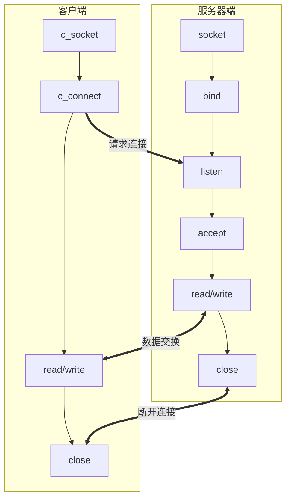
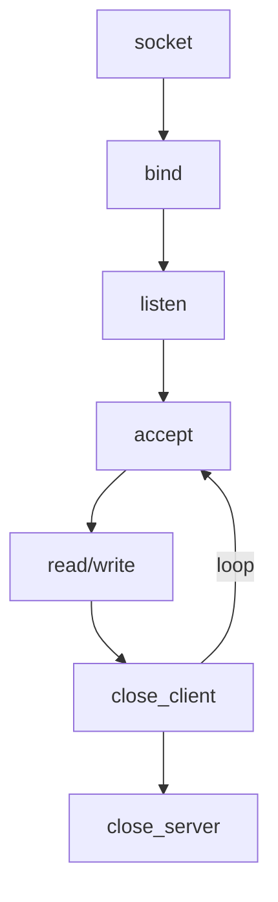

# 实现基于TCP的服务器端/客户端

## TCP服务器服务器端的默认函数调用顺序


`socket()`函数和`bind`函数在之前已经讨论过了。

### 进入等待连接请求状态

我们已经调用`bind`函数给套接字分配了地址之后，接下来就要通过调用`listen`函数进入等待连接请求状态。只有调用了listen函数，客户端才能进入可发出连接请求的状态。换言之，这是客户端才能调用`connect`函数。

```c
#include <sys/socket.h>

// 成功时返回0，失败时返回-1
/*
 * sock：希望进入等待连接请求状态的套接字文件描述符，
 *			传递的描述符套接字参数称为服务器端套接字（监听套接字）
 * backlog：连接请求等待队列（Queue）的长度，若为5，则队列长度为5
 *			表示最多使5个连接请求进入队列。
 */
int listen(int sock, int backlog);
```

客户端连接请求本身也是从网络中接收到的一种数据，而要想接收就需要套接字。此任务就由服务器端套接字完成。服务器端套接字时接收连接请求的一名门卫或一扇门。

客户端如果向服务器发起访问请求，服务器套接字就会将连接请求放到连接请求等待队列中。第二个参数决定了请求队列的大小。准备好服务器端套接字和连接请求等待队列后，这种可接收连接请求的状态称为等待连接请求状态。

`listen`函数的第二个参数值与服务器端的特定有关，像频繁接受请求的Web服务器端至少应为15.另外，连接请求队列的大小适中根据实验结果而定。

### 受理客户端连接请求

调用`listen`函数后，若有新的连接请求，则应按序受理。受理请求意味着进入可接收数据的状态。为了处理这些数据，我们需要一个套接字。之前创建的套接字只能作为接受请求的门卫，我们需要创建新的套接字。但是我们不需要自己创建，`accept`函数会为我们自动创建套接字，并连接到发起请求的客户端。

```c
#include <sys/socket.h>

// 成功时返回创建的套接字文件描述符，失败时返回-1
/*
 * sock：服务器套接字的文件描述符
 * addr：保存发起连接请求的客户端地址信息的变量地址值，调用函数后向传递来的地址变量参数填充客户端地址信息
 * addrlen：第二个参数addr结构体的长度，但是其保存的是长度的变量地址。函数调用完成后，该变量即被填入客户端地址长度。
 */
int accept(int sock, struct sockaddr* addr, socklen_t* addrlen);
```

`accept`函数受理连接请求队列中待处理的客户端连接请求。函数调用成功的时候，其内部将会产生用于数据IO的套接字，并返回其文件描述符。需要强调的是，套接字是自动创建的，并自动与发起连接请求的客户端建立连接。

### 回顾Hello world服务器端

需要注意的是，调用`accept`函数的时候若等待队列为空，则`accept`函数不会返回，直到队列中出现新的客户端连接。

## TCP客户端的默认函数调用顺序


与服务器相比，区别就在于“请求连接”，它是创建客户端套接字后向服务器端发起的连接请求。服务器端调用`listen`函数之后创建连接请求等待队列，之后客户端即可请求连接。

那么如何发起请求呢？就需要用到`connect`函数：

```c
#include <sys/socket.h>

// 成功时返回0，失败时返回-1
/*
 * sock：客户端套接字文件描述符
 * servaddr：保存目标服务器端地址信息的变量地址值
 * addrlen：以字节为单位传递已经传递给第二个结构体参数sevaddr的地址变量长度
 */
int connect(int sock, struct sockaddr* servaddr, socklen_t addrlen);
```

客户端调用`connect`函数后，发生以下情况之一才会返回（完成函数调用）：

+ 服务器端接收连接请求
+ 发生断网等异常情况而中断连接请求

需要注意，所谓的“接收连接”并不意味着服务器端调用`accept`函数，其实是服务器端把连接请求信息记录到等待队列。因此`connect`函数返回后并不立即进行数据交换。

> ###### 客户端套接字地址信息在哪？
>
> 实现服务器端必经过程之一就是给套接字分配IP和端口号。但客户端实现过程中并未出现套接字地址分配，而是创建套接字后立即调用`connect`函数。
>
> 难道客户端套接字无须分配IP和端口？当然不是。网络数据交换必须分配IP和端口。
>
> + 何时：调用`connect`函数时
> + 何地：操作系统，更准确的说是在内核中
> + 如何：IP用计算机IP，端口随机
>
> 客户端的IP地址和端口在调用`connect`函数时自动分配，无需调用标记的`bind`函数进行分配

## 基于TCP的服务器端/客户端函数调用关系

前文所说的TCP服务器端/客户端的实现顺序，实际上二者并非相互独立。如图所示：



# 实现迭代服务器端/客户端

> 编写回声（echo）服务器

## 实现迭代服务器端

之前我们所编写的服务器在处理完1个客户端连接请求之后立即退出，连接请求等待队列实际上没有太大意义。但这并非我们想象的服务器端。设置后等待队列大小后，应向所有客户端提供服务。如果向继续受理后续的客户端连接请求，最简单的方法就是插入循环语句反复调用



目前我们能够做到的是，只有在一个连接断开之后我们才能处理其他的连接。

## 迭代回声服务器端/客户端

上面所讲述的就是迭代服务器端。即使服务器端以迭代方式运转，客户端代码也没有太大区别。

### 服务端

首先整理程序的基本运行方式：

+ 服务器端在同一时刻只与一个客户端相联，并提供回声服务
+ 服务器端依次向5个客户端提供服务并退出
+ 客户端接收用户输入的字符串并发送到服务器端
+ 服务器端将接受的字符串数据传回到客户端，即“回声”
+ 服务器端与客户端之间的字符串回声一直执行到客户端输入Q为止

[echo_server](../示例代码/echo_server.c)

```c
#include <stdio.h>
#include <stdlib.h>
#include <string.h>
#include <unistd.h>
#include <arpa/inet.h>
#include <sys/socket.h>

#define BUF_SIZE 1024

void error_handling(char* message);

int main(int argc, char* argv[])
{
	// 定义监听Socket
	// 定义连接客户端的socket
	int serv_sock, clnt_sock;
	// 定义存储客户端发来消息的buffer
	char message[BUF_SIZE];
	// 记录发来消息的长度
	// 迭代次数
	int str_len, i;

	// 记录服务端、客户端协议族、地址族和端口号
	struct sockaddr_in serv_adr, clnt_adr;
	// 记录客户端地址长度
	socklen_t clnt_adr_sz;

	// 程序参数判断
	if (argc != 2)
	{
		printf("Usage : %s <port> \n", argv[0]);
		exit(1);
	}

	// 设置监听Socket：使用IPv4，流式传输
	serv_sock = socket(PF_INET, SOCK_STREAM, 0);
	if (serv_sock == -1)
	{
		error_handling("socket() error");
	}

	// 设置客户端sockaddr_in结构体
	memset(&serv_adr, 0, sizeof(serv_adr));
	serv_adr.sin_family = AF_INET;
	serv_adr.sin_addr.s_addr = htonl(INADDR_ANY);
	serv_adr.sin_port = htons(atoi(argv[1]));

	// 绑定服务端地址信息与socket
	if (bind(serv_sock, (struct sockaddr*)&serv_adr, sizeof(serv_adr)) == -1)
	{
		error_handling("bind() error");
	}

	// 设置为监听模式
	if (listen(serv_sock, 5) == -1)
	{
		error_handling("listen() error");
	}

	// 记录客户端地址结构体大小
	clnt_adr_sz = sizeof(clnt_adr);

	// 接收5次请求后结束
	for (i = 0; i < 5; i++)
	{
		// 处理请求
		clnt_sock = accept(serv_sock, (struct sockaddr*)&clnt_adr, &clnt_adr_sz);
		if (clnt_sock == -1)
		{
			error_handling("accept() error");
		}
		else
		{
			printf("Connected client %d \n", clnt_sock);
		}

		// 回声
		while ((str_len = read(clnt_sock, message, BUF_SIZE)) != 0)
		{
			write(clnt_sock, message, str_len);
		}

		close(clnt_sock);
	}

	close(serv_sock);

	return 0;
}

void error_handling(char* message)
{
	fputs(message, stderr);
	fputc('\n', stderr);
	exit(1);
}
```

### 客户端

[echo_client.c](../示例代码/echo_client.c)

```c
#include <stdio.h>
#include <stdlib.h>
#include <string.h>
#include <unistd.h>
#include <arpa/inet.h>
#include <sys/socket.h>

#define BUF_SIZE 1024

void error_handling(char* message);

int main(int argc, char* argv[])
{
	int sock;
	char message[BUF_SIZE];
	int str_len;
	struct sockaddr_in serv_adr;

	if (argc != 3)
	{
		printf("Usage : %s <IP> <port> \n", argv[0]);
		exit(1);
	}

	sock = socket(PF_INET, SOCK_STREAM, 0);
	if (sock == -1)
	{
		error_handling("socket() error");
	}

	memset(&serv_adr, 0, sizeof(serv_adr));
	serv_adr.sin_family = AF_INET;
	serv_adr.sin_addr.s_addr = inet_addr(argv[1]);
	serv_adr.sin_port = htons(atoi(argv[2]));

	if (connect(sock, (struct sockaddr *)&serv_adr, sizeof(serv_adr)) == -1)
	{
		error_handling("connect() error");
	}
	else
	{
		puts("connected ......");
	}

	while (1)
	{
		fputs("Input message(Q to quit): ", stdout);
		fgets(message, BUF_SIZE, stdin);

		if (!strcmp(message, "q\n") || !strcmp(message, "Q\n"))
		{
			break;
		}

		write(sock, message, strlen(message));
		str_len = read(sock, message, BUF_SIZE - 1);
		message[str_len] = 0;
		printf("Message from server: %s", message);
	}

	close(sock);

	return 0;
}

void error_handling(char* message)
{
	fputs(message, stderr);
	fputc('\n', stderr);
	exit(1);
}
```

### 回声客户端存在的问题

请观察这段来自[`echo_client.c`](../示例代码/echo_client.c)的代码：

```c
write(sock, message, strlen(message));
str_len = read(sock, message, BUF_SIZE - 1);
message[str_len] = 0;
printf("Message from server: %s", message);
```

这段代码有一个错误的假设：

> ###### 每次调用`read`和`write`函数时都会以字符串为单位执行实际的IO操作

换句话说，我们假设了我们不论输入怎样的字符串，`write`和`read`函数都会一次全部写入/读出。这不符合我们所说的“TCP不存在数据边界”的思想。我们的程序之所以正产运行，只是因为我们发的数据小，而且运行环境就是本地，但实际上确实存在发生错误的可能。
