[TOC]

> https://www.bilibili.com/video/BV12y4y1v7V3
> 
> HDL: Hardware Description Language

# Verilog HDL基础知识

> 语法形态与C语言非常相似，但是在设计方法上是完全不一样的

## 2.1 Verilog HDL 语言要素

> 不允许在Verilog HDL中出现中文，因为其对中文的支持极差

### 2.1.1 空白符

空白符包括空格符（`\b`）、制表符（`\t`）、换行符和换页符。在编译和综合的时候，空白符被忽略。

### 2.1.2 注释符

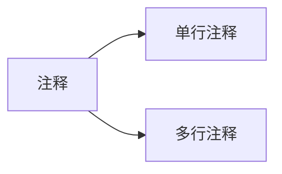
### 2.1.3 标识符与转移标识符

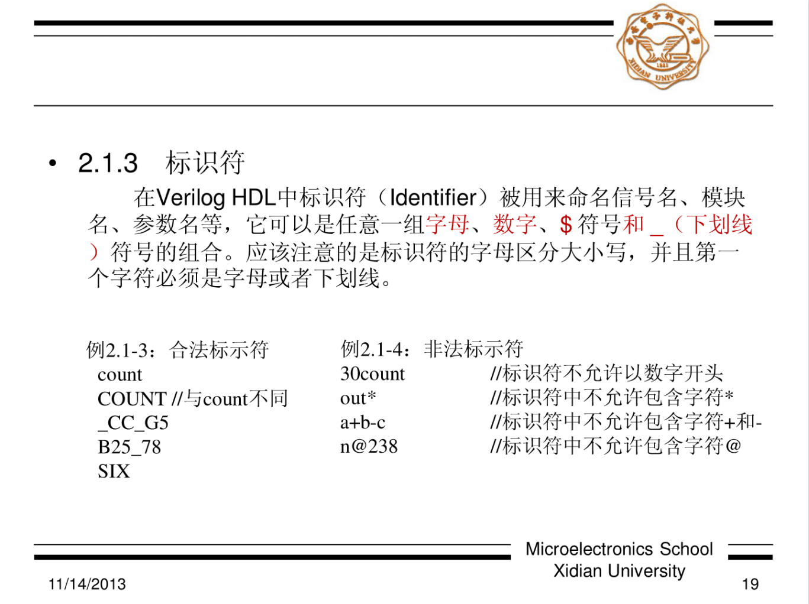
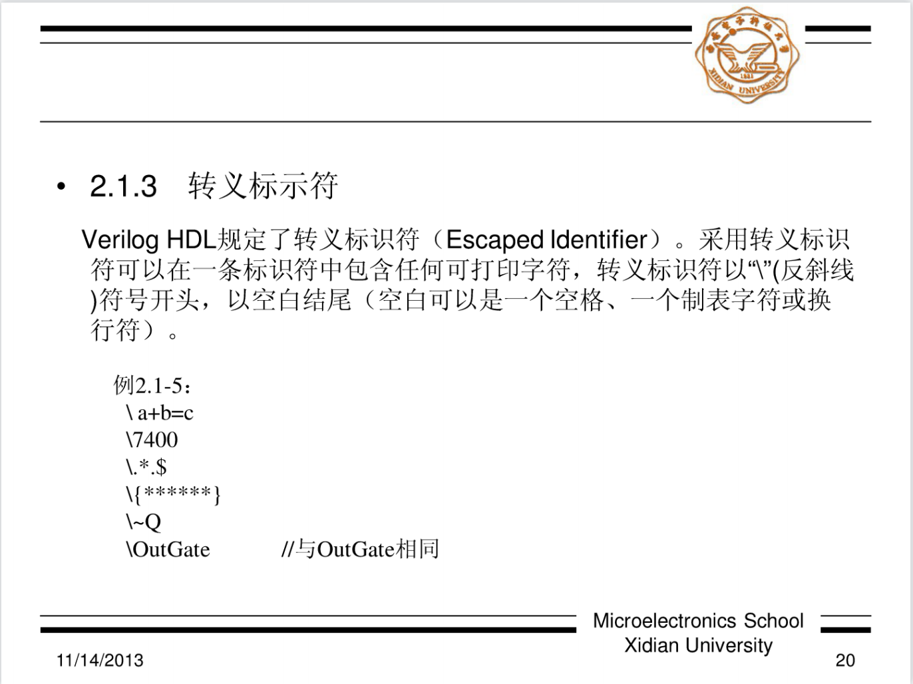

### 2.1.4 保留关键字

> 所有的保留关键字都是些小写的

### 2.1.5 数值

#### 逻辑数值状态

| 状态 |          含义          |
|:----:|:----------------------:|
|  0   |  低电平，逻辑0或者假   |
|  1   |  高电平，逻辑1或者真   |
| x或X | 不确定或未知的逻辑状态 |
| z或Z |         高阻态         |
#### 整数及其表示

> `+/-<size>'<base_format><number>`

| 数制   | 基数符号 | 合法标识符        |
| ------ | -------- | ----------------- |
| 二进制 | `b`或`B` | `0/1/x/X/z/Z/?/_` |
| 八进制 | `o`或`O` | `0~7/x/X/z/Z/?/_` |
| 十进制 | `d`或`D` | `0~9/_`           |
| 十六进制       | `h`或`H`         |                   `0~9/a-f/A~F/x/X/z/Z/?/_`|
#### 实数及其表示

1. 十进制表示法
	采用十进制，小数点两边必须都有数组，否则为非法的表示形式。
2. 科学计数法。

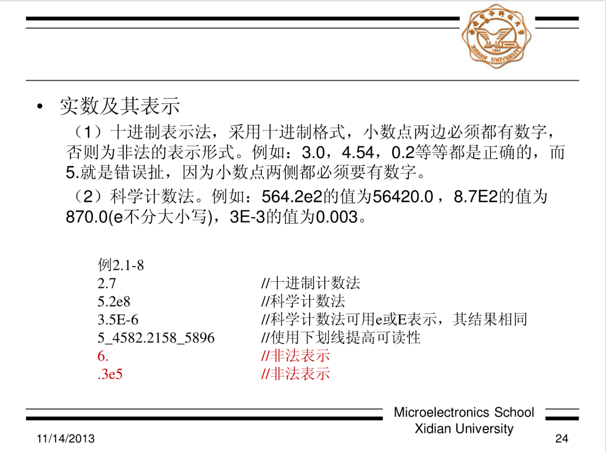

## 2.2 数据类型

> 根据电流强度进行区分

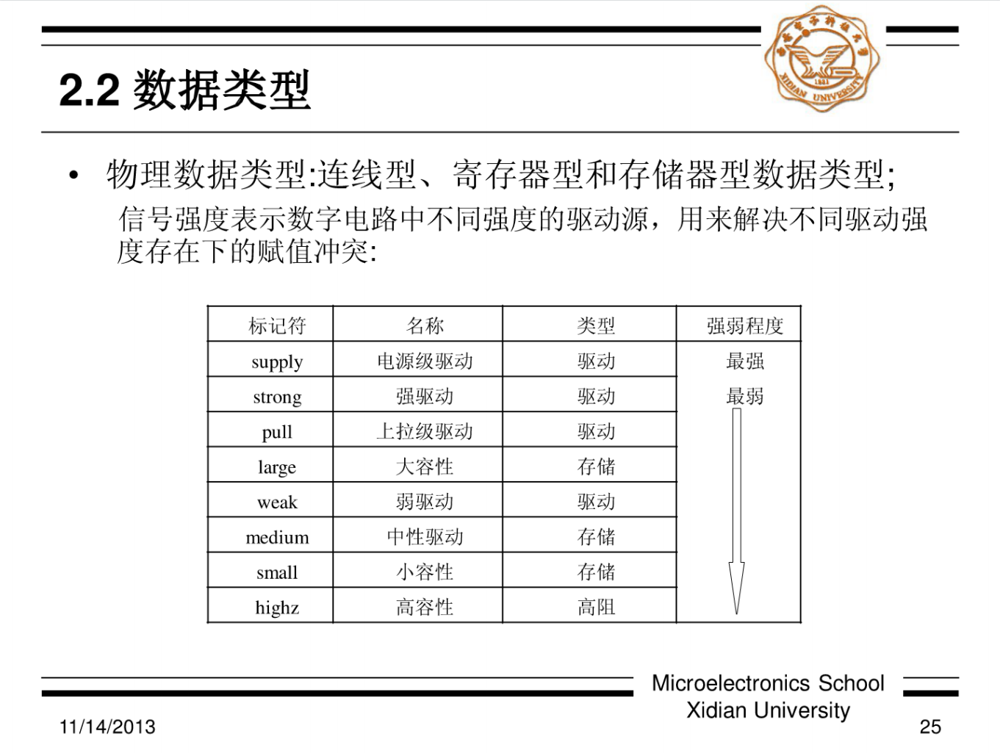

### 2.2.1 物理数据类型

#### 连线型

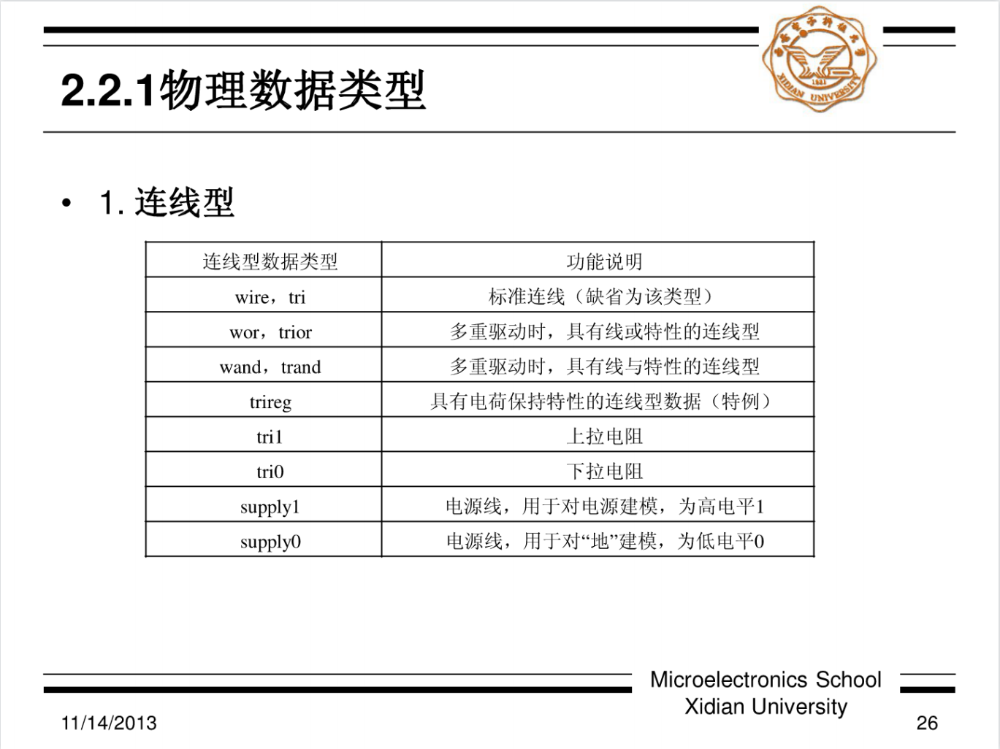

1. `wire`：只有`0/1/不定状态`
2. `tri`：`0/1/不定状态/高阻状态`
3. `wor`：当两个连线对一个接口进行驱动的时候，增加一个或门

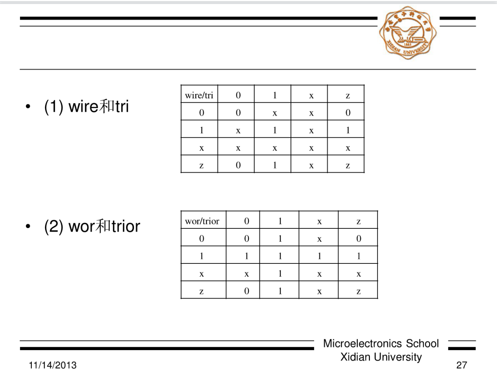

#### 寄存器型

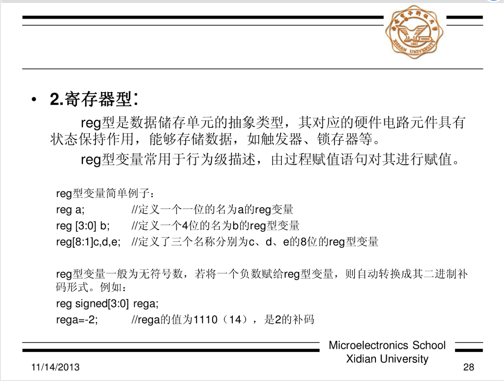

### 2.2.2 连线型和`reg`型数据类型的声明

> 驱动强度仅仅针对连线型变量

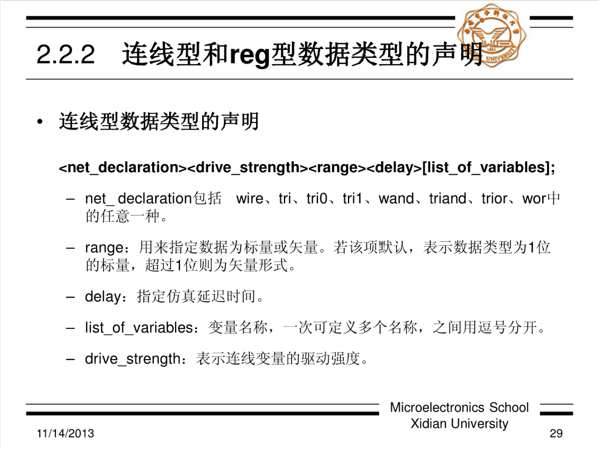

1. `range`：多少根线，一根线代表一个二进制数

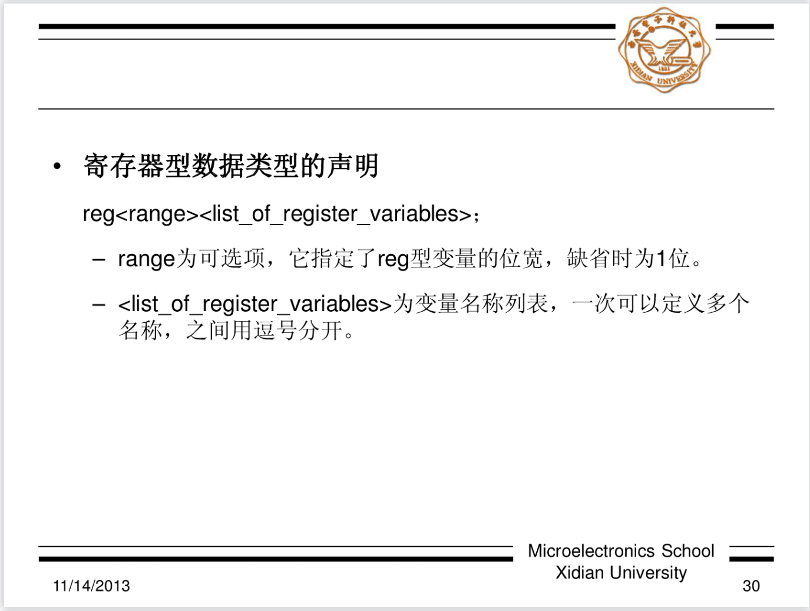

### 2.2.3 存储器类型

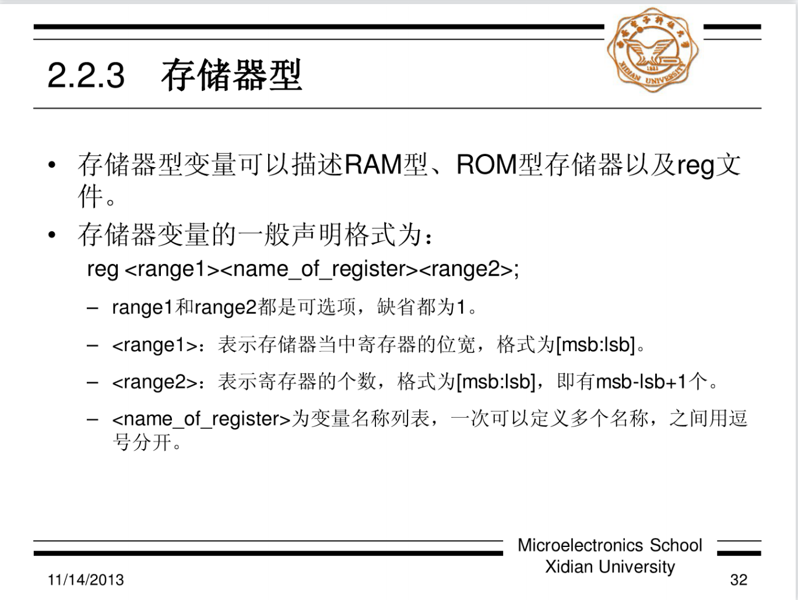

### 2.2.4 抽象数据类型

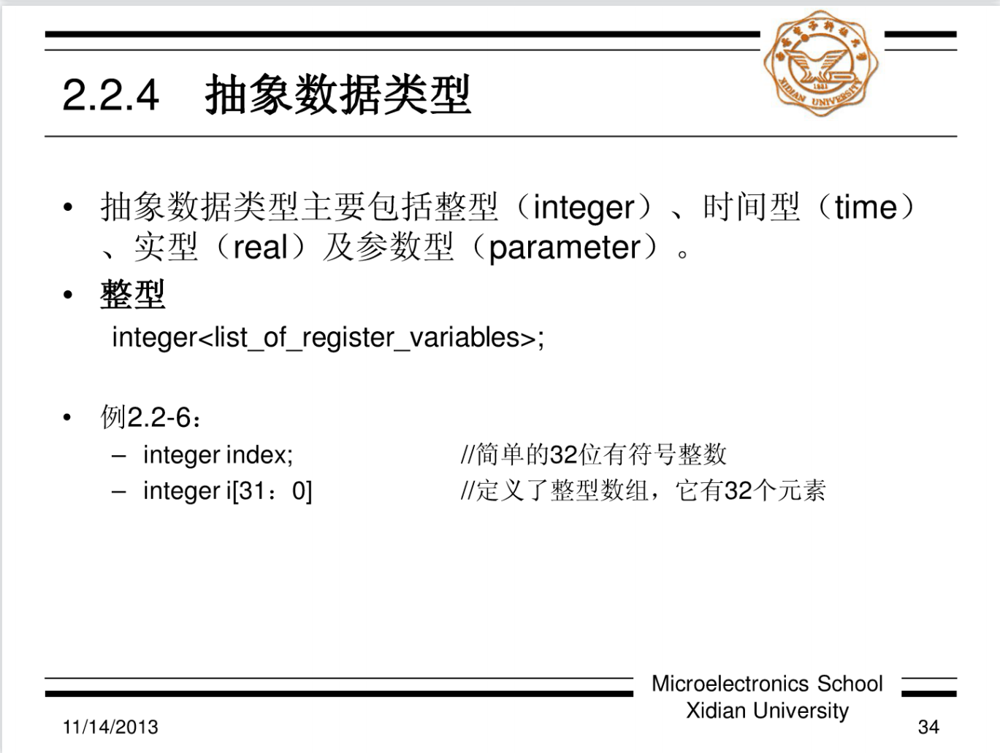