[TOC]

# 1.1.	并行计算机的种类

并行计算机通常包含多颗自带cache的CPU，而且这些CPU需要一定数量的内存才能工作；同时，这些CPU通常需要借助于网络传递数据从而实现CPU之间的协同工作；数据的显示则需要借助于显卡（CPU）。因此，并行计算机通常可以分为四大部件：CPU、GPU、存储器和网络。***通常，并行计算机的种类可以通过CPU与存储器的连接方式、数据的通信方式以及指令和数据之间的工作方式来划分。***

## CPU与存储器的连接方式

根据存储器与CPU的连接方式可以分为共享存储系统和分布存储系统。

### 共享存储系统

在共享存储系统中，所有CPU共同使用同一个存储器和IO设备，并且一般通过总线连接。

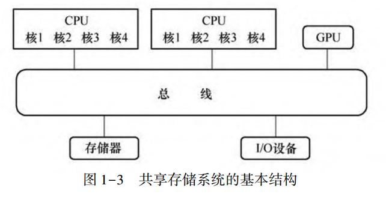

这种方式适合于实验室常见的计算服务器系统。计算用服务器一般为两路服务器或四路服务器。每一路通常安装一颗多核CPU，因此，计算用服务器一般有2颗或4颗CPU。

在共享存储系统中，内存地址是统一编址的，可以被CPU所共享；CPU之间数据通信依靠CPU对具有相同地址的内存单元的访问来实现。***但是当多颗CPU对同一地址的内存单元进行读写操作的时候，会出现访问冲突，即数据竞争。***

### 分布存储系统

通常，每颗CPU均具有各自的存储器和输入输出设备，它们组成了一个计算节点；多个计算节点通过网络相互连接形成了分布存储系统。这种方式适合于实验室常用的集群系统。由于每颗CPU都有自己的存储器，因此可以保证CPU访问存储器速度，不会出现访问冲突。另外，在网络中增加计算节点比较方便，即***系统的可扩展性能好。***但是各节点间必须借助于网络相互通信，因此数据通信比较困难，必须借助于专门的通信方法。

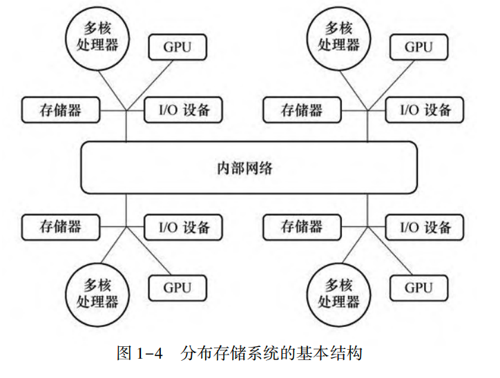

## 数据的通信方式

根据数据的通信方式，可以将并行计算系统分为共享地址空间系统和消息传递系统两大系统。

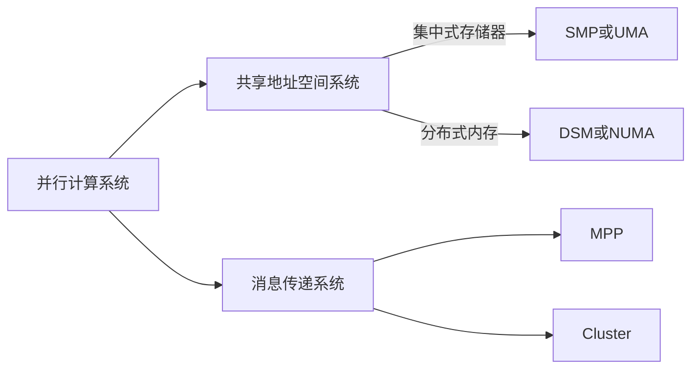

### 共享地址空间系统

在共享地址空间系统中，存储器的地址空间是统一的，因此可以称为单地址系统或共享存储多处理器（Shared Memory Multiprocessors, SMM）系统。

根据CPU与存储器的连接方式可将共享存储器多处理器系统进一步分类：如果存储器是集中式的，那么所有的处理器能够以相同的速度访问内存，这种系统称为***对称共享内存多处理器系统（Symmetric Shared-memory Multiprocessors或Symmetric Multiprocessors, SMP）***或***均匀存储访问系统（Uniform Memory Acess, UMA）***

如果内存是分布式的，那么CPU访问内存的速度就与内存的位置相关。毫无疑问，CPU访问本地内存的速度最快。换言之，由于处理器访问内存的速度是不一样的，因此称为***分布式共享内存系统（Distributed Shared-Memory, DSM）***或***非均匀存储访问系统（Nonuniform Memory Access, NUMA）。***

### 消息传递系统

在消息传递系统中，每个计算节点都是一个独立的计算机系统，而每个节点的存储器均单独编址，因此同一个地址对应于多个存储器。这样，节点间数据的传递不能通过本地节点的处理器字节访问其他节点的存储器来实现，而必须通过节点间相互发送含有数据信息的消息来实现。这种通过发送包含数据的消息来实现数据通信的消息称为消息传递系统。

这种通过发送包含数据的消息来实现数据通信的系统称为***消息传递系统***。它可分为大规模并行处理机系统（Massicvely Parallel Processor, MPP）和集群系统（Cluster）。

大规模并行处理机系统是指由几百或几千台处理机组成的大规模并行计算系统。此系统的很多硬件设备是专门设计制造的，它的网络传输速度较高但扩展性稍差，开发十分困难，通常标志着一个国家的综合实例。

而集群系统是相互连接的多个同构或异构的独立计算机的集合体，节点之间通过高性能互联网相互连接。每个节点都有自己的存储器、IO设备和操作系统，可以作为单机使用；并行任务的完成则是需要各节点之间的相互协同工作来完成。

## 常见的并行计算硬件系统

目前在实验室比较常见的计算机系统，大体上可以分为两类：一类是共享内存系统（SMP），例如个人计算机、工作站和服务器，其特点是多颗CPU拥有物理上共享的内存；一类是分布存储系统，如集群系统，其特点是系统由多个物理上分布的计算节点组成，每个计算节点拥有自己的内存，节点之间通过高速以太网或专用高速网络连接

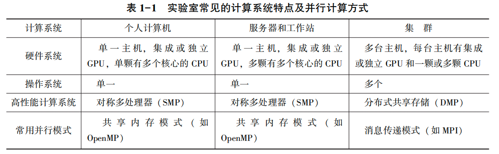

## 指令和数据之间的工作方式

1. 单指令流单数据流（Single Instruction Stream Single Data Stream, SISD），具有一个单处理器核的个人计算机可以归为此类
2. 单指令多数据流系统（Single Instruction Stream Multiple Data Stream, SIMD），它指在多颗CPU上运行相同的指令，但是每颗CPU所处理的数据对象并不相同
3. 多指令单数据流系统（Multiple Instruction Stream Single Data Stream, MISD），在实际应用中，这种系统是不存在的
4. 多指令多数据流系统（Multiple Instruction Stream Multiple Data Stream, MIMD），它指每颗CPU上执行的指令和处理的数据各不相同。目前常见的多核个人计算机和集群计算机可归为此类

# 1.2	并行计算

## 并行计算、高性能计算与超级计算

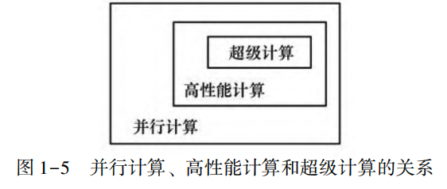

### 并行计算式

指多个CPU或多个CPU核的协同来解决同一个问题，即在计算任务重存在多个核心并行就视为并行计算。并行计算的实质是将一个待求解的问题分解成若干个子问题，各个子问题由独立的CPU同时进行计算。这样，计算单位在并行计算过程中往往需要频繁地交换数据，具有细粒度核低开销的特征。并行计算的重要特征是短的执行时间和高的可靠性，它主要是以高精度浮点运算为主的科学运算。

### 高性能计算

要求针对所使用的硬件环境（多核和GPU），通过向量化、提高Cache（缓存）命中率，采用多核心同时执行计算任务。高性能计算所面对的计算环境为10~100量级的CPU核心或GPU同时进行计算。

### 超算

指少量节点的高性能计算性能不足以满足实验计算量和运算规模需要，而必须在超级计算机或巨型机上解决的大型、复杂运算。不同专业、不同领域对超级计算的标准不同，河南给出一个超级计算阈值

## 并行处理技术

早起的计算机采用的是串行处理，计算机的各个操作只能串行地完成，即任一时刻只能进行一个操作。而并行处理能够同时进行多个操作，从而极大地提高了计算机的速度。

计算机的并行处理技术，概括起来主要有三种形式：

1. 时间并行。时间并行是指时间重叠，即多个处理过程在时间上相互错开，轮流重叠地使用同一套硬件设备的各个部分，从而加快硬件周转而赢得速度。时间并行的实现方式是采用流水处理部件，这是一种非常经济实用的并行技术，能保证计算机系统具有较高的性能价格比。
2. 空间并行。空间并行是指资源重复，即通过资源的重复配置来实现大幅度提高计算机的处理速度。大规模和超大规模集成电路的迅速发展，为空间并行技术带来了巨大生机，因而成为目前并行处理的一个主要途径。空间并行技术主要体现在多处理器系统和多处理机系统，同时在单处理机中也得到了广泛应用。
3. 时间和空间的同时并行。时间和空间的同时并行是指时间重叠和资源重复的综合应用，既采用时间并行性又采用空间并行性。相对而言，这种并行技术带来的高速效益是最好的。

# 高性能并行计算特征

1. 正确性
2. 高性能
3. 可扩展性

# 并行编程模式

并行编程是使用程序语言显式地进行说明，从而实现将计算任务重不同部分分配给不同的CPU同时执行。并行编程模式按通信方法可分为共享内存模式、消息传递模式、数据并行模式和异构计算模式。

目前，工程技术人员常用的并行编程模式是消息传递接口（Message Passing Interface, MPI）和直接控制共享内存式并行编程的应用程序接口（Open Multi-Processing, OpenMP）。

## 共享内存模式

共享内存存储，是指，多颗CPU都访问一个共享存储器。

在共享内存模型中，一个并行程序是由多个共享内存的并行任务组成，数据的交换通过隐式的使用共享数据（即线程间的通信通过对共享内存的读写操作）来完成。在大多数情况下，此编程模式的主要任务是对循环进行并行处理，而计算与数据的划分和任务之间的通信则由编译器自动完成。

目前，共享内存模式的主流开发标准是OpenMP，它是一种用于共享内存并行系统的多线程程序设计的一套指导性注释（Compiler Directive）。OpenMP支持的编程语言包括C、C++和Fortran；而支持OpenMP的编译器主要包括Intel Compiler和开放源码的GNU Compiler等。OpenMP提供的这种对于并行描述的注释语句降低了并行编程的难度和负载，这样编程人员可以把更多的精力投入到并行算法本身，而不关注其具体实现细节。OpenMP是一种基于数据并行的编程方式，即将相同的操作同时作用于不同的数据，从而提高问题求解速度。这种方式可以高效地解决大部分科学与工程计算问题。同时，OpenMP也提供了更强的灵活性，可以较容易地适应不同的并行系统配置。线程粒度和负载平衡等式传统多线程程序设计中的难题，但OpenMP可以帮助编程人员完成这两方面的部分工作。这样编程人员只需要简单地指明希望执行的并行操作以及并行操作对象，就能实现程序的并行编程，从而大幅度地减少编程人员的工作量。

OpenMP主要是针对循环进行并行，能有效地客服并行编程的可移植性和扩展性能差的缺点。近年来，实验室用微机、工作站和服务器多采用多核共享内存技术，为研究者使用以OpenMP为基础的并行计算方法提供了必要的硬件条件。

需要注意的是，OpenMP并不适合需要复杂的线程间同步和互斥的场合，而且不能再非共享内存系统（如计算机集群）上使用。

## 消息传递模式

消息传递模式是针对多地址空间进行的多进程异步并行模式。在消息传递模式中。一个并行程序是由多个并行任务组成，并且每个并行任务拥有自己的数据并对其进行计算操作。其基本特征是进程的显式同步、通过显式通信完成任务之间的数据转换、显式地数据映射和负载分配。

目前，广泛使用的消息传递模式有两种：并行虚拟机（Parallel Virtual Machine, PVM）和消息传递界面。

PVM是一种基于局域网的并行计算环境。它通过将多个异构的计算机有机地组织起来，形成一个容易变成、易于管理并且具有良好扩展性的并行计算环境。PVM能够在虚拟机中自动加载任务并运行，并且还提供了任务建相互通信和同步的手段。这种将所有的计算任务都分配到合适的计算节点上多节点并行运算模式实现了任务级的并行。

MPI是为开发基于消息传递模式的并行程序而制定的工业标准，其目的是为了提高并行程序的可移植性和扩展性以及较高的并行效率。目前，MPI已经发展成为消息传递模式的代表和事实上的工业标准。当采用MPI进行并行化计算时，每个进程都有各自独立的存储器。当进行全局共享数据的读写操作时，需进行计算机之间的通信从而实现数据的搬迁。因此MPI需要明确划分数据结构并重构源程序，编程困难并且开发周期长。

PVM与MPI所提供的功能大致相同，但是它们各自的侧重点不同。MPI比较适合于在同构集群上的并行应用。它的通信方便，可以直接在进程组内进行矩阵的运算操作，十分有利于科学运算；但MPI不提供容错机制，因此当一个错误发生后，整个应用全部失败。PVM更适合于异构的集群系统。PVM强调在异构环境下的可移植性和互操作性，但程序之间的通信相对较差，并支持动态的资源管理和一定程度的容错。

目前几乎所有的高性能计算系统都支持PVM和MPI。

# OpenMP和MPI的特点

在并行计算领域，MPI和OpenMP是最为流行的编程模型。目前，大多数编程人员面临的一个最大问题是确定所编写的程序代码运行的硬件条件，即采用集群系统还是工作站。这个问题的答案取决于应用需求。如果编程人员进需要获得约10~100倍的性能提升，那么使用OpenMP的方法，这样编程简单，并且易于维护；如果编程人员需要更多的内核，实现100倍以上性能的提升，那么可以尝试MPI；为了充分利用集群的层次存储结构特点，还可以考虑将上述两种编程模型相结合，实现MPI和OpenMP的混合编程，即利用MPI实现节点间的并行，利用OpenMP实现节点内的多线程并行。总之，不同的并行方式具有各自不同的优点和缺点，需要我们自己选择。

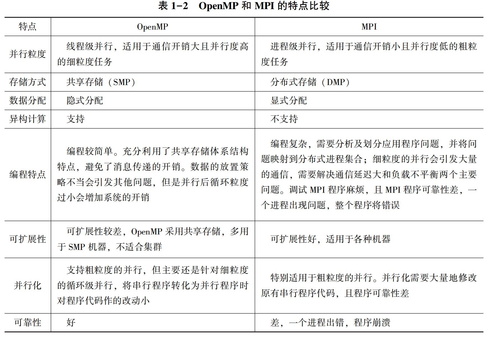

这里，任务粒度是指并行执行过程中，两次通信之间每个处理机计算量大小的一个粗略描述。它的计算式如下：
$$
任务粒度=\frac{执行时间}{任务通信时间}
$$
一般而言，粗粒度（含有大量顺序执行指令且需要大量时间）的任务并行度低，但通信开销小；细粒度（仅有一条或几条顺序执行指令，需要时间少）的任务并行度高，但通信开销大。因此，增大粒度可以减少创建线程和线程间通信的代价，提高效率，但也意味着减少并行的线程数，降低并行性。

需要指出的是，MPI入门难，开发效率低，被称为并行语言中的汇编。由于MPI程序设计的复杂、冗长和高代价，已经阻碍了MPI的应用和开发。因此，对于大多数科技人员，OpenMP是一个较好的选择。

# 并行计算中常用概念

## 并发、并行和并行计算

并发（Concurrent）和并行（Parallel）是两个相似又不相同的概念。从宏观上来讲，并发和并行都是同时处理多路请求的概念。但并发和并行又有不同区别，并行是指两个或多个时间在同一时刻发生；而并发是指两个或多个时间在同一时间间隔内发生。

### 并发

并发性，又称并行性，是指在同一个CPU上能处理多个同时（并不是真正的同时，只是看来是同时，因为CPU需要再多个程序间切换）程序的能力。并发的实质是物理CPU在若干程序之间多路复用，并发性是对有限物理资源强制行使多用户共享以提高效率。当有多个线程在操作时，如果系统只有一个CPU，则它根本不可能真正同时进行一个以上的线程。它只能把CPU运行时间划分为若干段，再将时间段分配给各个线程执行。在同一个时间段的线程代码运行时，其他线程处于挂起状态。这种方式被称为并发。

### 并行

并行性指两个或两个以上时间或活动在同一时刻发生。在多个程序环境下，并行性使多个程序同一时刻可以在不同CPU上执行。假如系统有一个以上的CPU，当一个CPU执行一个线程时，另一个CPU可以执行另一个县城，两个线程互不抢占CPU资源，可以同时进行，这种执行方式被称为并行。

### 并行计算

并行计算是相对于串行计算来说的。它是一种一次可执行多个指令的算法，目的是提高计算速度，通过扩大问题求解规模，快速解决大型而复杂的计算问题。

实际山，并行计算是指同时使用多种计算资源解决计算问题的过程，是提高计算机系统计算速度和处理能力的一种有效手段。它的基本思想是用多个处理器阿里系统求解同一问题，即将被求解的问题分解成若干个部分，各部分均由一个独立的处理器来并行计算。并行计算系统既可以是专门设计的、含有多个处理器的超级计算机，也可以是以某种方式互联的若干台独立计算机构成的集群。并行计算可分为时间上的并行和空间上的并行。时间上的并行指的是流水线技术；空间上的并行是指多个处理机并发的执行计算，即通过网络将两个以上的处理机连接起来，达到同时计算同一个任务的不同部分，或者完成单个处理机无法解决的大型问题。

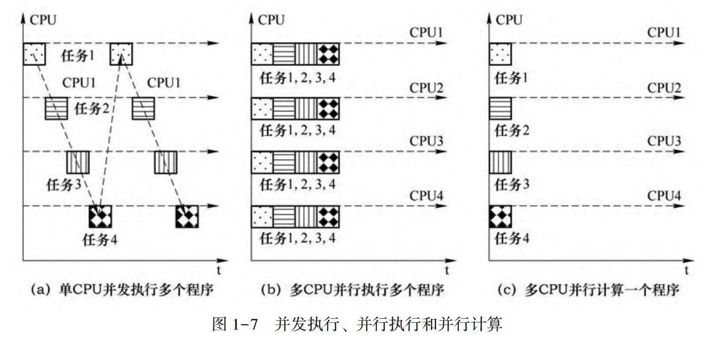

## 程序、线程、进程和超线程

程序是一组指令的有序集合。

而进程是具有一定独立功能的程序关于某个数据集合上的一次运行活动,是系统进行资源分配和调度的一个独立单位。实际上,进程是正在运行的程序的一个实例。

线程则是进程的一个实体,是比进程更小的能独立运行的基本单位,是被系统调度和分配的基本单元。线程自身基本上不拥有系统资源,只拥有一点在运行中必不可少的资源(如程序计数器、一组寄存器和调用堆栈),但它与同属一个进程的其他线程共享所属进程所拥有的全部资源,同一个进程的多个线程可以并发执行,从而提高了系统资源的利用率。

例如,采用Fortran、C++等语言编写的源程序经相应的编译器编译成可执行文件后,提交给计算机CPU进行执行。此时,处于执行状态的一个应用程序称为一个进程。从用户角度来看,进程是应用程序的一个执行过程。从操作系统角度来看,进程代表的是操作系统分配的内存、CPU时间片等资源的基本单位,是为正在运行的程序提供的运行环境。

### 进程与程序的关系和区别

具体而言,进程和程序的区别和联系如下:

1. 程序是一组指令的有序集合。它本身没有任何运行的含义,只是存在于计算机系统的硬盘等存储空间中一个静态的实体文件。而进程是处于动态条件下由操作系统维护的系统资源管理实体。进程具有自己的生命周期,反映了一个程序在一定的数据集上运行的全部动态过程。

2. 进程和程序并不是一一对应的,一个程序在不同的数据集上执行就成为不同的进程。由于程序没有和数据产生直接的联系,即使是执行不同数据的程序,它们的指令集合依然是一样的。一般来说,一个进程肯定有一个与之对应的程序,而且只有一个。但是,如果程序没有执行,那么这个程序就没有与之对应的进程;如果一个程序在几个不同的数据集上运行,那么这个程序就有多个进程与之对应。

3. 进程还具有并发性和交往性,这也与程序的封闭性不同。

### 进程与线程的区别与联系

进程与线程的区别与联系如下:

1. 一个程序的执行至少有一个进程,一个进程至少包含一个线程(主线程)。
2. 线程的划分尺度小于进程,所以多线程程序并发性更高。
3. 进程是系统进行资源分配和调度的一个独立单位,线程是CPU调度和分派的基本单位。同一进程内允许多个线程共享其资源。
4. 进程拥有独立的内存单元,即进程之间相互独立;同一进程内多个线程共享内存。因此,线程间能通过读写操作对它们都可见的内存进行通信,而进程间的相互通信则需要借助于消息的传递。
5. 每个线程都有一个程序运行的入口,顺序执行序列和程序运行的出口,但线程不能单独执行,必须依存于进程中,由进程控制多个线程的执行。
6. 进程比线程拥有更多的相应状态,所以创建或销毁进程的开销要比创建或销毁线程的开销大得多。因此,进程存在的时间长,而线程则随着计算的进行不断地动态地派生和缩并。
7. 一个线程可以创建和撤销另一个线程。而且同一进程中的多个线程共享所属进程所拥有的全部资源;同时进程之间也可以并行执行,从而更好地改善了系统资源的利用率

### 超线程

超线程技术就是利用特殊的硬件指令，把两个逻辑内核模拟成两个物理芯片，让单颗 CPU 都能进行线程级并行计算，进而兼容多线程操作系统和软件。这样可以减少 CPU 的闲置时间，提高 CPU 的运行效率。采用超线程后，应用程序在同一时间内可以使用心片的不同部分。虽然单线程芯片每秒钟能够处理成干上万条指令，但是在任一时刻只能够对一条指令进行操作；而超线程技术可以使芯片同时进行多线程处理，从而提升了芯片性能。虽然采用超线程技术能同时执行两个线程，但它养不能像两颗真正的 CPU 那样使每颗 CPU 都具有独立的资源。当两个线程同时需要某一个资源时，其中一个要暂时停止，并让出资源，直到这些资源闲置后才能继续执行。因此，超线程的性能并不等于两颗 CPU 的性能，它实际上是一种并发执行方式。

## 单核编程和多核编程

单核 CPU 在某一时刻只能处理一个进程。所谓单核 CPU 的多进程模式是通过时间片轮转的方法快速地在各个进程间切换从而实现在不同时刻交替执行不同的任务，即伪并行。多核 CPU 的出现为提高计算机的运算速度提供了一种新的模式。多核编程计算就是把很多个单核连起来，协调工作，实现运算和处理能力的提升。多核 CPU 的多核模式是在物理上的并行执行，即在同一时刻允许有多个进程（或线程）在并行执行。

目前的微机系统，往往采用一颗两核或四核的 CPU；计算用服务器或工作站则采用两颗（或更多颗）四核（或六核）CPU。在多核编程中，编程人员只需关心共享内存系统能够提供的 CPU 核心数量，而不必关心所用的 CPU 核心位于哪颗 CPU 上。即对多核编程来说，不同 CPU 上的核心的地位和作用是相同的。

与单核编程（串行程序）相比，多核编程具有如下的特点：

1. 串行程序针对一颗 CPU 核进行编程，执行方式是顺序执行；多核程序针对多颗CPU（或多个 CPU 核）编程，程序是并行执行的。
2. 串行程序在多核计算机上执行时，只有一个 CPU 核在运行程序，其他 CPU 核处于空闲状态；多核程序在多 CPU（或多 CPU 核）计算机上执行时，计算机的全部（或部分）CPU（或 CPU 核）在部分时间段内同一时刻并行执行。
3. 串行程序执行时，CPU 可随时对内存进行读写操作；多核程序执行时则会遇到数据竞争问题。如果多个线程对共享数据均进行读操作，对共享数据的访问无需加锁保护；而如果多个线程对共享数据进行写操作，则需对共享数据的访问进行加锁保护。
4. 单核编程时，无需考虑 CPU 核间的负载平衡；多核编程必须考虑各个线程的计算量均衡地分配到各 CPU 核上，从而实现最小的计算时间。

## 多线程编程和多进程编程

与多进程编程相比，多线程编程具有如下优点：

1. 创建一个线程比创建一个进程的代价小。线程共享进程的资源，线程被创建时不需要再分配内存等资源，因而创建线程所需的时间要少。
2. 线程的切换比进程的切换代价小。线程作为执行单元，从同一进程的某个线程切换到另一线程时，需载人的信息比进程切换时要少，所以切换速度更快。
3. 可以充分利用多 CPU 资源。同一进程的线程可以在多个 CPU 核上并行运行。
4. 同一个进程内可以方便地共享数据。数据共享使得线程之间的通信比进程间的通信更高效。

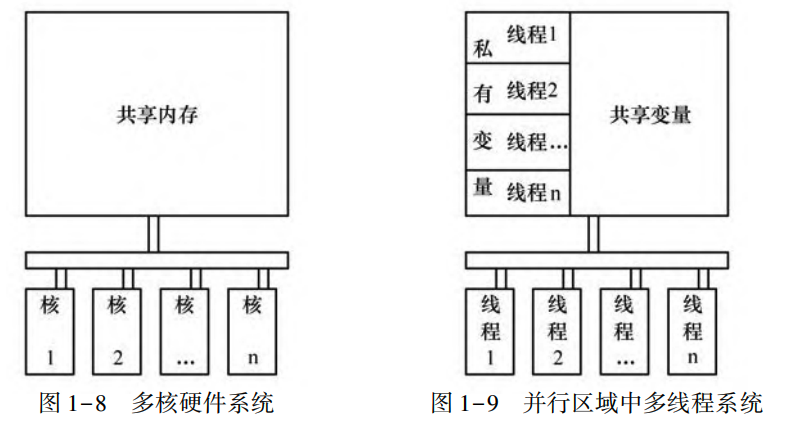

进程的资源包括进程的地址空间，打开的文件和IO等资源。

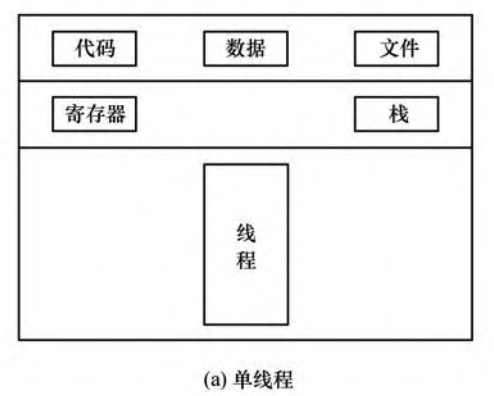

同一进程的所有线程共享该进程的地址空间、代码段和数据段，打开的文件等。每个线程都具有自己的线程编号、线程执行状态、寄存器集合和堆栈。

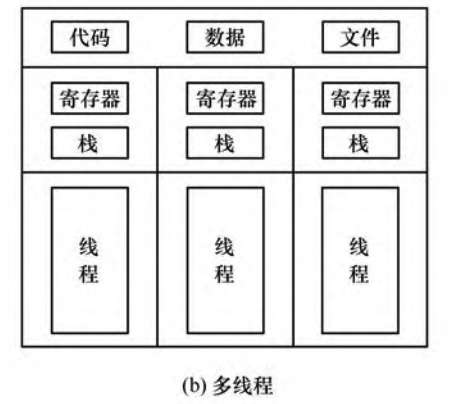

# OpenMP多核编程

确定应用 OpenMP 的时机和掌握 OpenMP 的语法同样重要。一般而言，在下面的情况下可以考虑应用 OpenMP:

1. 计算平台是多核或者多 CPU 平台。如果单 CPU 的处理能力已经被应用程序用尽，那么通过使用 OpenMP 使之成为多线程应用程序肯定可以提高性能。

2. 程序需要跨平台。OpenMP 通过编译指导语句实现并行，因此使用 OpenMP 编译指导语句的程序能够在不支持 OpenMP 标准的编译器上编译，从而实现跨平台运行。

3. 循环计算是计算瓶颈。OpenMP 主要针对循环进行并行化，如果应用程序具有一些没有循环依赖的循环，那么使用 OpenMP 能大幅度地提高性能。

4. 优化的需要。因为使用 OpenMP 不需要大幅修改已有的程序，所以它是一个理想的进行小改动而获取高性能的实用工具。

综上所述，OpenMP 并不能用来处理所有多线程问题。这是因为它原本是为高性能计算的应用需要而开发的，所以它在包含大量数据共享且存在复杂循环体的循环中才会有更优异的表现。当然，使用 OpenMP 也必须付出代价。要想从 OpenMP 获取性能提升，就必须让并行区域的加速比大于线程组的开销。

# 常用编译器与OpenMP

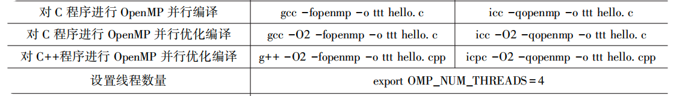