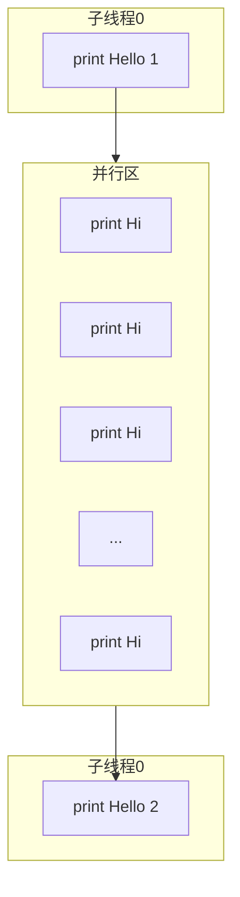

[TOC]

> 并行控制类型用来设置并行区域创建线程组，即产生多个线程来并行执行任务；工作共享类型将任务分配给各线程或进行向量化，工作共享指令不能产生新的线程，因此必须位于并行域中；数据环境类型负责并行域内的变量属性（共享或私有）、边界上（串行域与并行域）、主机和异构计算设备间的数据传递；线程同步类型利用互斥锁和事件通知的机制来控制线程的执行顺序，保证执行结果的确定性；库函数和环境变量则是用来设置和获取执行环境相关的信息。


OpenMP 由编译指导语句（或编译制导语句）、库函数和环境变量三部分组成。其指导思想是将工作划分为多个子任务分配给多个线程，从而实现多核并行处理单一的地址空间，避免了转向消息传递或其他并行编程模型时所具有的风险。但是，支持 OpenMP 的编译器不会检测数据依赖、冲突、死锁、竞争以及其他可能导致程序不能正确执行的问题，这些问题必须由编程人员自己解决。

# 编程指导语句


OpenMP应用程序的三个组成部分：编译指导语句，库函数和环境变量。

+ 编译指导语句是串行程序实现并行化的桥梁，是编写OpenMP应用程序的关键。但是，编译知道语句的优势仅体现在编译阶段，对运行阶段的支持较少。
+ 因此，编程人员需要利用库函数在程序运行阶段改变和优化并行环境从而控制程序的运行。
+ 而环境变量则是库函数控制函数运行的一些具体参数。

# 并行执行模式

OpenMP采用的执行模式是：


其特点如下：

1. 在程序的串行区，由线程0执行串行代码。
2. 程序从执行开始到执行结束，主线程（通常是线程0）一直在运行。
3. 在程序的并行区域，主线程和派生出来的子线程共同工作执行代码。
4. 如果并行区域没有执行完毕，则不能执行串行区的代码。即主线程和派生出来的子线程只有在执行完并行区域的全部并行代码后，才能将子线程缩并（退出或者挂起），然后由主线程继续执行位于并行区域后面的串行区代码。
5. 在并行区域结束后，派生出来的子线程缩并，由主线程单独执行代码。

## 编译指导语句格式

+ 指令名：`#pragma omp`作为OpenMP编译指导指令前缀
+ 指令名：在指导指令前缀和子句之间必须有一个有效的OpenMP指导指令
+ 子句列表：这是可选项。除非有另外的限制，否则子句能够按照任意顺序排序
+ 续行符：这是可选项。采用`\`表示。表示编译指导语句还未结束，在第二行继续
+ 换行符：必选项。位于被这个指令包围的结构快之前，表明这条编译指导语句的结束

指令名后的选项可以按任意次序排列，需要时可以重复。但是编译指导语句不能嵌入到C/C++语句中，C/C++语句也不能嵌入到编译指导语句中。

C/C++格式文件需满足以下条件：

1. 以`#pragma omp`作为OpenMP指导语句的标识符

2. 每个编译指导语句必须以换行符结尾，并遵循C和C++编译器编译指令标准

3. 长指令可以在行尾使用续行符：

    ```c
    #pragma omp parallel for default(none) \
    	private(i, j, sum) shared(m, n, a, b, c)
    ```

4. C/C++程序中OpenMP指令区分大小写，所有编译指导语句格式均用小写字母表示

5. 每条指令只能有一个指令名称

6. 每条指令应用于随后的一个语句，该语句必须为结构快。如果结构快包含多行语句，可以用大括号括起来

7. 注释语句与OpenMP编译指导语句不能在同一行出现

8. OpenMP并行程序编写方法采用增量并行方式。具体而言，逐步改造现有的串行程序，每次只对部分代码进行并行化，这样可以逐步改造，逐步调试

## 主要指令

指令用来指导多个CPU共享任务或用来指导多个CPU同步，而指令后面的子句则给出了相应的指令参数，从而影响编译指导语句的具体执行。除了5个指令（`flush`/`critical`/`master`/`ordered`/`atomic`）没有相应的子句以外，其他的指令都有一组适合的子句


在所示的这些指令中，一些指令须进行语句绑定，才能使用。

1. 指令 for、 sections、 single、 master 和 barrier、task 等必须绑定在指令 parallel 定义的并行区域中。如果这些指令不在并行区域内执行，则是无效指令。
2. 指令 simd 可以出现在 parallel 指令定义的并行区域中，也可以出现在串行区域中。
3. 指令 ordered 必须与 do 指令绑定。
4. 指令 atomic 使 atomic 指令下第一个语句在所有线程中都能互斥地进行读写数据操作，但是 atomic 只能保护一句代码。
5. 指令 critical 使所有 critical 结构中的语句在所有线程中都能互斥地进行读写数据操作，但是指令 critical 只能保护一个并行程序块。
6. 除指令 parallel 外，一个指令不能与其他指令绑定使用。

以下是不允许绑定使用的指令

1. 指令 for、sections 和 single 可以绑定到同一个 parallel 中，但它们之间不允许互相嵌套，也不能将它们嵌套到隐式任务、critical 结构、atomic 结构、ordered 结构和 master 结构中。
2. 指令 parallel、 flush、 critical 、 atomic 和隐式任务不允许出现在 atomic 结构中。
3. 指令 critical 不允许互相嵌套。
4. 指令 barvier 不允许出现在并行构造(for、sections 和 single)、 critical 结构、atomic 结构、ordered 结构、master结构和隐式任务中。
5. 指令 master不允许出现在并行构造（for、 sections 和 single)、 critical 结构、atomic 结构和隐式任务中。
6. 指令 ordered 不允许出现在 critical 结构、atomic 结构和隐式任务中。

## 主要子句

在指令后面常用的选项如下：

1. private（变量列表）。
2.  shared（变量列表）。
3. default (none | shared)。
4. reduction（运算符：变量列表）等。


## 指令的作用域

OpenMP指令的作用域分为三种情况：

1. 静态范围。代码由一条 OpenMP 指令开头，写在一个结构块的开始和结束之间。指令的静态范围不能跨越多个函数或代码文件。文本代码在一个编译指导语句的后面，被封装到一个代码块（或结构块）中。
2. 孤立范围。孤立指令是独立于其他的指令的一个 OpenMP 的指令。它处于另外一个指令的静态范围之外，可以跨越多个例程或代码文件。OpenMP 规范不限制工作共享和同步指令（omp for，omp single, critical， barrier 等）在并行区城内部。
3. 动态范围。指令的动态范围包括它的静态范围和孤立范围。事实上，当一个孤立的工作共享或同步指令位于程序的串行部分（即在任何并行区域的动态范围以外），只有主线程才会执行此指令。换言之，该 OpenMP 指令将被忽略。

## 指令与子句的配套使用


然而，在OpenMP 指令中，master、critical、 barrier、 atomie、 flush、 ordered、 threadpri-vate 指令必须单独使用，不能与子句联合使用。对于两个指令的绑定，必须遵循如下原则：

1. 如果存在 parallel 区域，指令 for、 sections、 single、 master、 barrier 和 target 需要绑定到动态封装的 parallel 区域内；如果当前没有要被执行的 parallel 区域，则这些指令就没有效果。
2. 指令 ordered 需要绑定到动态封装的 for 区域内。
3. 指令不会绑定到超出最邻近那个 parallel 封装的任何其他指令结构。

对于两个指令的嵌套，须遵循如下原则：

1. 当一个parallel 区域嵌套在另一个 parallel 区域时，将产生一个新的线程组。此线程组默认为一个线程。
2. 绑定到同一个 parallel 的指令 for、sections 和 single, 不允许相互嵌套。(
3. 指令 for、 sections 和 single 不允许在 critical、 ordered 和 master 区域的动态范围内。
4. 相同命名的 critical 指令不允许相互嵌套。
5. 指令 barrier 不允许在 for、 ordered、 sections、 single、 master 和 critical 区域的动态范围内。
6. 指令 master 不允许在指令 for、sections 和 single 的动态范围内。
7. 指令 ordered 不允许在 citical 区域的动态范围内。
8. 任何允许在一个 parallel 区域动态执行的指令也被允许在一个 parallel 区域外执行。当指令在一个用户指定的并行区域外动态执行时，只受由主线程组成的线程组的影响。

# 头文件

```c
#include <omp.h>
```

# 常用库函数

库函数可以分为三种：运行时环境函数、锁函数和时间函数

1. omp_set_num_threads：设置后续并行区域中并行执行的线程数量。
2.  omp_get_num_procs：返回计算系统的处理器数量。
3. omp_get_num_threads：确定当前并行区域内活动线程数量。如果在并行区域外调用，该函数的返回值为1。
4. omp_get_thread_num：返回当前的线程号。线程号的值在0（主线程）到线程总数减1之间。
5.  omp_get_max_threads：返回当前的并行区域内可用的最大线程数量。
6. omp_get_dynamie：判断是否支持动态改变线程数量。
7.  omp_set_dynamic：启用或关闭线程数量的动态改变。
8. omp_get_wtime：返回值是一个双精度实数，单位为秒。此数值代表相对于某个任意参考时刻而言已经经历的时间。
9.  omp_init _lock：初始化一个简单锁。_
10.  omp_set_lock：给一个简单锁上锁。
11. omp_unset lock：给一个简单锁解锁，须与 omp_set_lock 函数配对使用。
12. omp_destroy_lock：关闭一个锁并释放内存，须与 omp_ init lock 函数配对使用。需要指出的是，以 omp_set_开头的函数只能在并行区域外调用，其他函数可在并行区域和串行区域使用。

# 最简单的并行程序

在此给出一个简单的示例程序：

```c
#include <stdio.h>

int main()
{
    printf("Hello 1\n");
    printf("Hi\n");
    printf("Hello 2\n");
    
    return 0;
}
```

程序的执行流程如图所示：


使用OpenMP重写上述程序：

```c
#include <omp.h>
#include <stdio.h>

int main()
{
    printf("Hello 1\n");
    
    #pragma omp parallel
    {
        printf("Hi\n");
    }
    printf("Hello 2\n");
    
    return 0;
}
```

我们这样编译：

```shell
g++ -fopenmp -o ttt hh.cpp
```

或者：

```shell
icpc -qopenmp -o ttt hh.cpp
```

可能的程序运行结果：

```
Hello 1
HHi
Hi
Hi
Hi
Hi
Hi
Hi
Hi
Hi
Hi
Hi
Hi
Hi
Hi
Hi
Hi
Hi
Hi
Hi
Hi
i
Hi
Hi
Hi
Hello 2
```

上述程序有以下特点：



1. 在程序开头，`#include <omp.h>`是对OpenMP库函数的生命，这样在程序中不需要重新定义其数据类型
2. 当程序开始执行时，只有主线程（线程0）存在，主线程执行程序的串行区工作，即打印`Hello 1`
3. 遇到并行区域的结构指令`#pragma omp parallel`之后，主线程派生出其他线程来执行任务，即子线程0和其他线程组成的线程组共同打印`Hi`，由于没有显式地设置可使用的线程总数，所以默认线程总数为系统能够提供的CPU总核数。
4. 在并行区域的结束位置后，派生的子线程进行缩并（退出或挂起），不再工作。最终只剩下主线程继续执行串行区工作，打印`Hello 2`

下面是采用OpenMP实现的一个标准并行程序：

```c++
#include <omp.h>
#include <cstdio>
#include <stdio.h>

using namespace std;

int main()
{
        int tid, mcpu;

        tid = omp_get_thread_num();
        mcpu = omp_get_num_threads();

        printf("Hello from thread %d in %d CPUs\n", tid, mcpu);
        printf("------before parallel\n\n");
        printf("------duiring parallel\n");

        #pragma omp parallel num_threads(3) private(tid, mcpu)
        {
                tid = omp_get_thread_num();
                mcpu = omp_get_num_threads();
                printf("Hello from thread %d in %d CPUs\n", tid, mcpu);
        }

        printf("\n");
        printf("------after parallel\n");
        printf("Hello from thread %d in %d CPUs\n", tid, mcpu);

        return 0;
}
```

可能的运行结果：

```
Hello from thread 0 in 1 CPUs
------before parallel

------duiring parallel
Hello from thread 0 in 3 CPUs
Hello from thread 2 in 3 CPUs
Hello from thread 1 in 3 CPUs

------after parallel
Hello from thread 0 in 1 CPUs
```

从程序和输出结果可以看出，上述程序具有如下特点：

1. 并行程序被`#pragma omp parallel { }`分割成并行前的串行程序段、并行程序段和并行后的串行程序三大部分

2. 在遇到指令`parallel(#pragma omp parallel)`之前，程序处于串行区。串行区代码仅由一个线程（即主线程，此线程的编号为0）控制，所以实际使用的线程数为1

3. 在并行区域前的串行程序段中，我们有以下调用：

    ```cpp
    call omp_set_num_threads(3);
    tid = omp_get_thread_num();
    mcpu = omp_get_num_threads();
    ```

    其中，库函数`omp_set_num_threads（）`没有返回值，其作用是设置在并行区域内允许使用的线程总数；库函数`omp_get_thread_num()`的返回值类型为整数类型，此返回值给出当前线程的线程号；库函数`omp_get_num_threads()`的返回值为整数类型，此返回值给出执行并行块所使用的线程总数。

    需要指出的是，线程总数不要大于处理器数量与每个处理器所包含的核心数目的乘积。

4. 当遇到一个`parallel`指令之后，程序进入并行区域。在并行区域内，主线程派生了另外的2个线程，这样当前线程总数达到库函数`omp_set_num_threads()`所定义的3个线程。主线程也属于这个线程组，并在线程组内的线程号为0，线程组中的其他子线程分别为1,2。这3个线程分别执行了打印语句，输出了各自的子线程号。

    需要指出的是，子线程的产生和执行并不是按01,2,3,4，...这样的顺序，而是具有随机性

5. 各子线程表征其线程号的变量名均为`tid`，但是各子线程拥有的线程号却不相同。可以采用`default(none)`声明线程中使用的变量必须显式地指定是共享变量还是私有变量，然后采用`private`子句指定变量`tid`和`mcpu`为私有变量。这样，各子线程拥有的私有变量`tid`才不会互相影响。而各子线程通过调用函数`omp_set_num_threads()`获得当前线程组的线程数目。虽然各线程获得的`mcpu`的值是相同的，但是各线程均会对变量`mcpu`进行写操作。为了避免数据竞争，这里也将`mcpu`定义为私有变量

