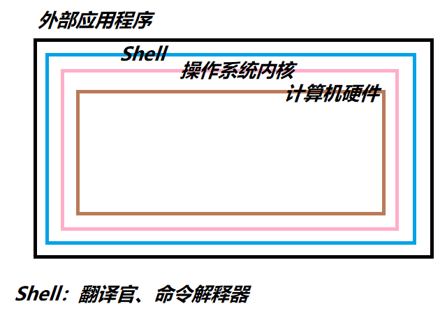

> [vedio](https://www.bilibili.com/video/BV1Aa411e7Rg)

# What is shell

## What does shell do




## What is shell script

Write some shell commands in a file, then execute the file to execute the commands at once. This is a shell script. These files are extended as `.sh` in Linux and `.bat` in Windows.

### Shebang

In computer program, `shebang` means the first two characters `#!` at the first line of the text file .

In Unix system, the program will analyze the content after `shebang` as the command to the interpreter. Such as:

*	As for files start with `#! /bin/sh`, the program calls `/bin/sh` at the execution time, which is bash interpreter.
*	As for files start with `#! /user/bin/python`, it means specifying the python interpreter to execute the file.
*	As for files start with `#! /usr/bin/env <name of interpreter>`, it is a method to find correct interpreters on different platforms.

***Attention***

* If the shell script hasn't specified `shebang`, the script will be interpreted with current shell at execution time defaultly, which means `$SHELL`
* If `shebang` specified executable interpreter, such as `/bin/bash` or `/usr/bin/python`, the filename will be pass as parameter then the script is executed.
* If the interpreter program specified by `!#` does not have permissions, error **"bad interpreter: Permission denied"** will occur
* If the interpreter program specified by `!#` is not a runnable program, the interpreter program will be ignored and current shell will execute it instead.
* if the interpreter program specified by `!#` does not exist, error "bad interpreter: No such file or directory" will occur.
* The path of interpreter specified by `#!` must be an absolute path for the program won't look for it in the `$PATH`
* If you use command `bash test.sh` to execute the script, the `#!` line will be ignored, for the bash will be the interpreter specified by you without doubt.

### example

```shell
#! /bin/bash
# A shell script to print "Hello World!"
echo "Hello World!"
```

***execute***
```shell
# method 1
./hello.sh	# chmod +x hello.sh to grant permision
# method 2
shell hello.sh
```

# Shell Variables

> Variables are where to store data temporarily.

> ```shell
> name="123"
> echo $name		# print "123"
> sudo -i
> echo $name		# print an empty line
> ```

## Basic Notes

### Definition / Assignment / Naming

* The definition and assignment of variables mustn't contain spaces
	* ```shell
	  name = "123"
	  Error: "name" is not a command
	```
	
	* Shell is a weakly typed language, the definition and assignment can go together without defining type beforehand.
* The substitution and reference of variables
	* ```shell
	  name="123"
	  echo $name
	  echo ${name}	# full spelling
	```
* The rule of naming variables:

	* The naming of variables must be clear and comprehensible 
	* Only contains numbers, alphabets and `_`
	* Mustn't start with number
	* Mustn't contain punctuation mark
	* Case sensitive


### Variables and their scope

* Local variables are only for current process.

	* Check current process tree: `pstree`
	* ```shell
	  var1="123"
	  echo $var1	# "123"
	  # enter a new shell
	  sh
	  echo $var1	# ""
	  ```
* Environment variables, which is also called global variables, can be found in all the shell, such as `$PATH`
* positional parameters: Used in shell script to pass parameters.
* Special parameters:

	* `$?`
		* 0: Success
		* 1-255: Error Code
	* ```shell
	  ls -s
	  $?		# 0: the last command was successful
	  ```
# Parent & Child Shell

Parameters in shell are defaultly defined as string

```shell
# the same
age=17
age='17'
age="17"
```

However, `""`can specify special characters while `''` can not.

```shell
name=123
name1='$name'
name2="$name"
echo name1		# "$name"
echo name2		# "123"
```

## Different ways of execution create different shell environments

1.	Each time we call `bash/sh` to execute a script, it will create a child shell. Therefore local parameters won't be saved.

	```shell
	# make_var.sh
	var="123"

	# in current shell environment
	name="watermellon"
	sh make_var.sh
	echo var		# "123"
	echo name		# ""
	```

2.	`source / .` loads scripts in current environment, therefore parameters will be saved.
	
	```shell
	# make_var.sh
	var="123"

	# in current shell environment
	name="watermellon"
	source make_var.sh
	echo var			# "123"

	echo name			# "watermellon"
	```

## Save the result of command execution

```shell
# `command`

files=`ls`
echo files		# print nodes in current directory
```

## Practice

***Which one is the correct answer of the following quesion?***

```shell
$ cat test.sh
user1=`whoami`
$ sh test.sh
$ echo $user1
```

***Answer: ""***

## Environment Variables

> Environment variables are usually refer to the variables exported by build-in command `export`, which are used to define runtime environment of shell and make sure the correct execution of it.
>
> Shell determine username, `PATH`, file system and so on with environment variables.
>
> Environment variables can be created for a short time in command line. However, these variables will be lost when the user quits shell terminal. To make these changes last, we need to modify ***environment variables config file***
>
> Each user has their own environment variables files. `~/.bash_profile` and `~/.bashrc`, and the system load variables first from personal config file. 
>
> To add an environment variable for all users, write it into `/etc/profile`

### Commands to check system environment variables

* `set`: print all the variables in current environment, including global variables and local variables
* `env`: print global environment variables only
* `declare`: print all the variables, just like `set`
* `export`: print and set environment variables
	```shell
	export name="123456"
	```

### Cancel Environment Variables

* `unset <variable>`: delete variable or function

### Set readonly variables

> Variables are invalidated only when the shell terminates

```shell
readonly name="123"
```

### System Reserved Keywords

* `$PATH`
