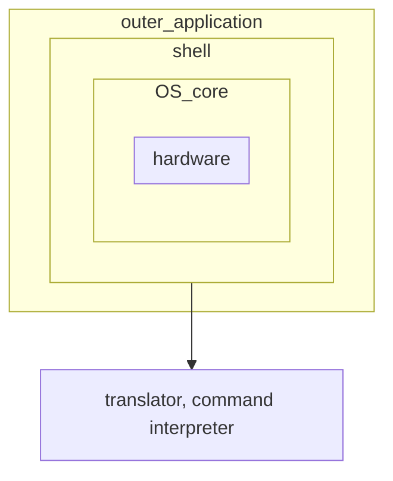

> [vedio](https://www.bilibili.com/video/BV1Aa411e7Rg)

# What is shell

## What does shell do



## What is shell script

Write some shell commands in a file, then excute the file to excute the commands at once. This is a shell script. These files are extended as `.sh` in Linux and `.bat` in Windows.

### Shebang

In computer program, `shebang` means the first two characters `#!` at the first line of the text file .

In Unix system, the program will analyse the content after `shebang` as the command to the interpreter. Such as:

*	As for files start with `#! /bin/sh`, the program calls `/bin/sh` at the execution time, which is bash interpreter.
*	As for files start with `#! /user/bin/python`, it means specifying the python interpreter to execute the file.
*	As for files start with `#! /usr/bin/env <name of interpreter>`, it is a method to find correct interpreters on different platforms.

***Attention***

* If the shell script hasn't specified `shebang`, the script will be interpreted with current shell at execution time defaultly, which means `$SHELL`
* If `shebang` specified executable interpreter, such as `/bin/bash` or `/usr/bin/python`, the filename will be pass as parameter then the script is executed.
* If the interpreter program specified by `!#` does not have permissions, error **"bad interpreter: Permission denied"** wiil occur
* If the interpreter program specified by `!#` is not a runnable program, the interpreter program will be ignored and current shell will execute it instead.
* if the interpreter program specified by `!#` does not exist, error "bad interpreter: No such file or directory" will occur.
* The path of interpreter specified by `#!` must be an absolute path for the program won't look for it in the `$PATH`
* If you use command `bash test.sh` to execute the script, the `#!` line will be ignored, for the bash will be the interpreter specified by you without doubt.

### example

```shell
#! /bin/bash
# A shell script to print "Hello World!"
echo "Hello World!"
```

***execute***
```shell
# method 1
./hello.sh	# chmod +x hello.sh to grant permision
# method 2
shell hello.sh
```

# Shell Variables

> Variables are where to store data temporarily.

> ```shell
> name="123"
> echo $name		# print "123"
> sudo -i
> echo $name		# print an empty line
> ```

## Basic Notes

### Definitiono / Assignment / Naming

* The definition and assignment of variables mustn't contain spaces
	* ```shell
	  name = "123"
	  Error: "name" is not a command
	  ```
	
	* Shell is a weakly typed language, the definition and assignment can go together without defining type beforehand.
* The substitution and reference of variables
	* ```shell
	  name="123"
	  echo $name
	  echo ${name}	# full spelling
	  ```
* The rule of naming variables:

	* The naming of variables must be clear and comprehensible 
	* Only contains numbers, alphabets and `_`
	* Mustn't start with number
	* Mustn't contain punctuation mark
	* Case sensitive


### The scope of variables


