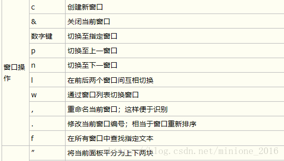
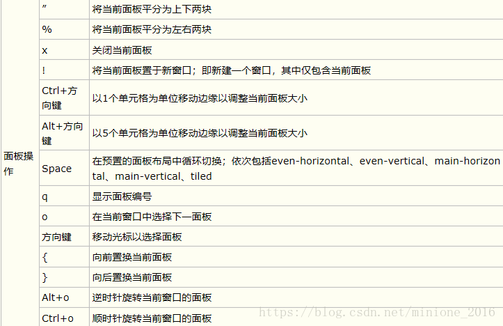
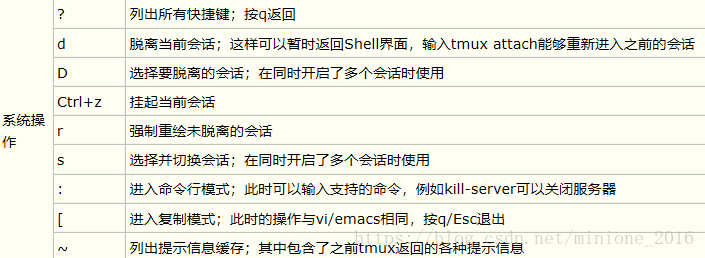

# tmux

# Tmux的概念和基本使用

> Tmux默认的快捷键前缀是`Ctrl+B`，当然我们也可以修改它
> 

## Tmux的几个重要概念

1. 会话（***Session***）：建立一个tmux工作区会话
2. 窗口（***Window***）：容纳多个窗格
3. 窗格（***Pane***）：可以在窗口中分成多个窗格

## Tmux的基本使用

1. 创建一个tmux会话：`tmux new -s <session name>`
2. 在多个会话之间切换：
3. 分屏（创建新的窗格）：
    1. 垂直分屏：`Ctrl+B %`
    2. 水平分屏：`Ctrl+B :`
4. 创建新的窗口：`Ctrl+B C`
5. 切换窗口：
    1. 上一个窗口：`Ctrl+B p`
    2. 下一个窗口：`Ctrl+B n`

# Tmux的快捷键







```bash
# 开启新session
tmux
# 开启新session并命名
tmux new -s my_session

# 显示所有session
tmux ls

# 使用session编号接入
tmux attach -t 0
# 使用session名称接入
tmux attach -t <session-name>
tmux a -t name #简写

# 使用session编号kill
tmux kill-session -t 0
# 使用session名称kill
tmux kill-session -t <session-name>

# 使用session编号切换
tmux switch -t 0
# 使用session名称切换
tmux switch -t <session-name>

# 重命名会话
tmux rename-session -t 0 <new-name>

# 选择需要跳转的session会话
C + b s

# 重命名当前会话
C + b $

# 断开当前session
C + b d

# 在当前session中多加一个window
C + b c

# 在一个session中的多个window中作出选择
C + b w

# 关闭当前session中的当前window
C + b x

# 进入tmux翻屏模式, 实现上下翻页
C + b [  
### 进入翻屏模式后PgUp PgDn 实现上下翻页（mac可以用fn + ↑ ↓实现上下翻页）
### q 退出翻屏模式

#############
# 其他常用快捷键
##############

C + b ！  #关闭一个session中所有窗口
C + b % #将当前窗口分成左右两分
C + b " #将当前窗口分成上下两分
C + b 方向键 #让光标在不同的窗口中跳转 
C + b 方向键 #按住C+b不放，同时按住方向键，可以调节光标所在窗口的大小
```

# 基于Tmux的结对编程

Tom与John在不同的地方登录到服务器，Tom打开tmux简历一个会话：tmux new -s for_John,那么，当John登录到服务器后，就可以tmux a -t for_John登陆同一对话框，这样的话，两个人各自在自己的工位工作，不用挪屁股找对方（或者一个在深圳一个在北京），另外一方都可以看见，那么这个时候两个人配合语音电话交流，就可以一起协作工作或者John帮Tom debug解决问题了，十分不错。

# Tmux配置文件——`~/.tmux.conf`

第一次启动配置文件：

`source-file ~/.tmux.conf`
